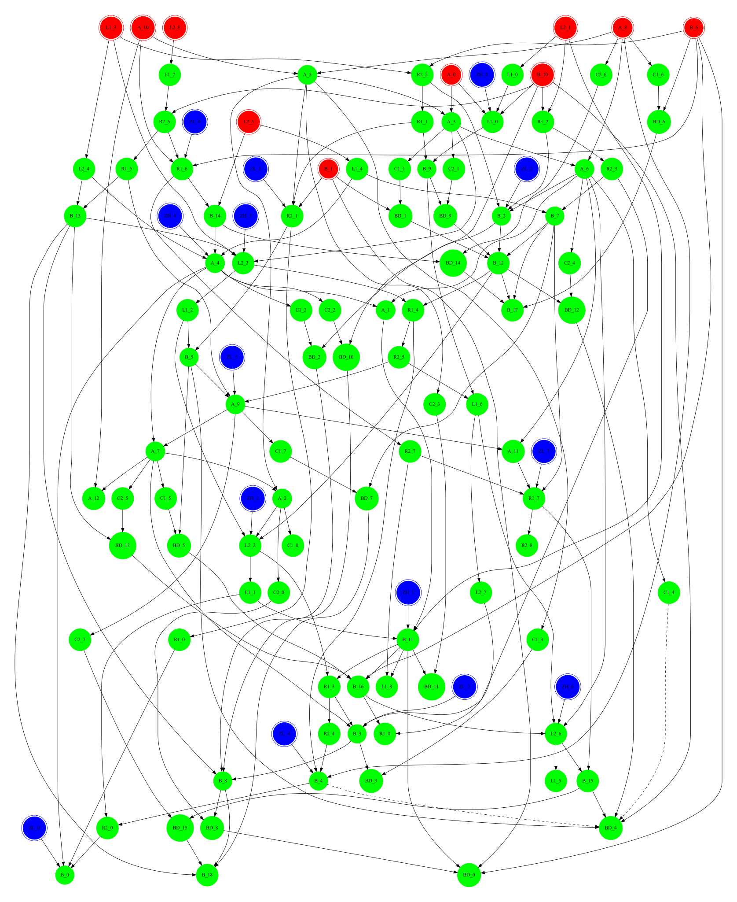
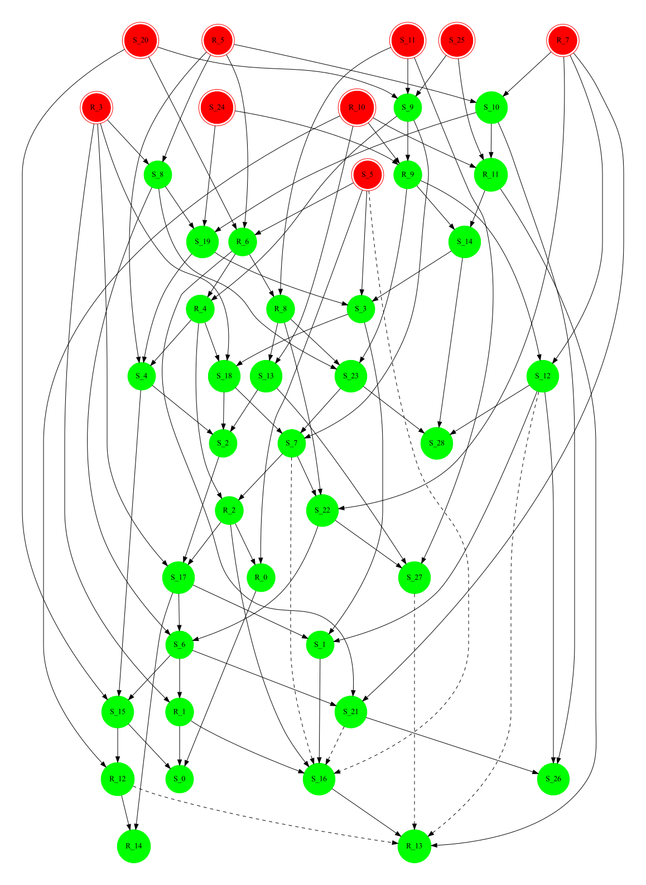

# Autoguess

[](./LICENSE.txt)


Autoguess integrates a wide range of CP/SMT/SAT/MILP solvers, as well as the Groebner basis algorithm to automatically solve the guess-and-determine (GD) problem.

---

## Overall Structure

The following shape represents the overall structure of Autoguess. As it can be seen, Autoguess relies on [Minizinc](https://www.minizinc.org/), [PySAT](https://github.com/pysathq/pysat), [pySMT](https://github.com/pysmt/pysmt), [Gurobi](https://www.gurobi.com/) and [SageMath](https://www.sagemath.org/). Providing a Python interface, Autoguess translates the guess-and-determine problem to a SAT, SMT, MILP or Groebner basis computation problem and then call an appropriate solver to solve it. It also utilizes [Grazphviz](https://pypi.org/project/graphviz/) to visualize the discovered determination flow.


---

- [Autoguess](#autoguess)
  - [Overall Structure](#overall-structure)
  - [Installation](#installation)
    - [Method 1](#method-1)
    - [Method 2](#method-2)
    - [Method 3](#method-3)
  - [Format of Input File](#format-of-input-file)
  - [Manual](#manual)
    - [Example 1](#example-1)
    - [Example 2](#example-2)
    - [Example 3](#example-3)
    - [Example 4](#example-4)
    - [Example 5](#example-5)
    - [Example 6](#example-6)
  - [Applications](#applications)
    - [GD Attack on 1 Round of AES with 1 Known Plaintext/Ciphertext Pair](#gd-attack-on-1-round-of-aes-with-1-known-plaintextciphertext-pair)
    - [GD Attack on 2 Rounds of AES with 1 Known Plaintext/Ciphertext Pair](#gd-attack-on-2-rounds-of-aes-with-1-known-plaintextciphertext-pair)
    - [GD Attack on 3 Rounds of AES with 1 Known Plaintext/Ciphertext Pair](#gd-attack-on-3-rounds-of-aes-with-1-known-plaintextciphertext-pair)
    - [GD Attack on 14 Rounds of Khudra with 1 Known Plaintext/Ciphertext Pair](#gd-attack-on-14-rounds-of-khudra-with-1-known-plaintextciphertext-pair)
    - [GD Attack on 11 Rounds of SKINNY-n-n with 1 Known Plaintext/Ciphertext Pair](#gd-attack-on-11-rounds-of-skinny-n-n-with-1-known-plaintextciphertext-pair)
    - [GD Attack on Enocoro128-v2](#gd-attack-on-enocoro128-v2)
    - [GD Attack on KCipher2](#gd-attack-on-kcipher2)
    - [GD Attack on SNOW1](#gd-attack-on-snow1)
    - [GD Attack on SNOW2](#gd-attack-on-snow2)
    - [GD Attack on SNOW3](#gd-attack-on-snow3)
    - [GD Attack on ZUC](#gd-attack-on-zuc)
    - [GD Attack on Bivium-A](#gd-attack-on-bivium-a)
    - [Key-bridging in Linear Attack on PRESENT](#key-bridging-in-linear-attack-on-present)
    - [Key-bridging in Integral Attack on LBlock](#key-bridging-in-integral-attack-on-lblock)
    - [Key Bridging in Impossible Differential Attack on LBlock](#key-bridging-in-impossible-differential-attack-on-lblock)
    - [Key Bridging in Zero Correlation Attack on SKINNY-64-128](#key-bridging-in-zero-correlation-attack-on-skinny-64-128)
    - [Key Bridging in Zero Correlation Attack on SKINNY-64-192](#key-bridging-in-zero-correlation-attack-on-skinny-64-192)
    - [Key Bridging in DS-MITM Attack on SKINNY-128-384](#key-bridging-in-ds-mitm-attack-on-skinny-128-384)
    - [Key Bridging in Impossible Differential Attack on T-TWINE-80](#key-bridging-in-impossible-differential-attack-on-t-twine-80)
    - [Key Bridging in Impossible Differential Attack on T-TWINE-128](#key-bridging-in-impossible-differential-attack-on-t-twine-128)
  - [The Paper](#the-paper)
  - [License](#license)

## Installation

Autoguess has been developed in [Debian](https://en.wikipedia.org/wiki/Debian) which is one of the most used [Linux](https://en.wikipedia.org/wiki/Linux_distribution) distributions. However, thanks to [Docker](https://www.docker.com/) it can simply be used in other platforms including macOS and Windows. We suggest the following methods to install and use Autoguess.

### Method 1

The easiest way is using the provided [Dockerfile](docker/Dockerfile) to get Autoguess and all of its dependencies at once. To do so, regardless of what OS you use, install [Docker](https://docs.docker.com/get-docker/) at first. Next, download our [Dockerfile](docker/Dockerfile), navigate into the directory where you have stored it and build a local image of Autoguess via the following single line command:

```sh
docker build -f Dockerfile -t autoguess .
```

Next, you will be able to run Autoguess via the following command:

```sh
docker run --rm -it autoguess
```

The constructed image is self-contained including MiniZinc, PySAT, pySMT, SageMath. Although Autoguess includes a direct Python interface to [Gurobi](https://www.gurobi.com/) as well, Gurobi is not included in the above image. Hence, Gurobi and its license should be installed separately if you are willing to use the MILP-based method to solve the guess-and-determine problem.

### Method 2

If you have already installed [Docker](https://www.docker.com/) and you are not enough patient to build a local image of Autoguess, you can simply download a prebuilt image of Autoguess hosted on [Docker Hub](https://hub.docker.com/) via the following command:

```sh
docker pull hoseinhadipour/autoguess
```

Then, you can run Autoguess by the following command:

```sh
docker run --rm -it hoseinhadipour/autoguess
```

### Method 3

For the Debian-based Linux operating systems, following the below instructions you can simply install Autoguess.

- Download Autoguess:

   ```sh
   mkdir /home/tools/ & cd /home/tools/
   git clone https://github.com/hadipourh/autoguess
   ```

- Install prerequisites:
  
  ```sh
  apt-get install python3-dev
  python3 -m pip install cython
  ```

- Install PySAT:
  
  ```sh
  python3 -m pip install python-sat[pblib,aiger]
  ```

- Install pySMT:
  
  ```sh
  python3 -m pip install pysmt
  ```

- Install SMT solvers supported by pySMT:

  - Install [Boolector](https://github.com/Boolector/boolector)

    ```sh
    python3 -m pysmt install --btor  
    ```

  - Install [Z3](https://github.com/Z3Prover/z3)

    ```sh
    python3 -m pip install z3-solver
    ```

- Install MiniZinc
  
  ```sh
  mkdir /home/tools/ && cd /home/tools/
  wget https://github.com/MiniZinc/MiniZincIDE/releases/download/2.5.5/MiniZincIDE-2.5.5-bundle-linux-x86_64.tgz
  mkdir MiniZinc
  tar zxvf MiniZincIDE-2.5.5-bundle-linux-x86_64.tgz -C MiniZinc --strip-components=1
  rm MiniZincIDE-2.5.5-bundle-linux-x86_64.tgz
  ln -s /home/tools/MiniZinc/bin/minizinc /usr/local/bin/minizinc
  python3 -m pip install minizinc
  ```

- Install Or-Tools

  ```sh
  mkdir /home/tools/ && cd /home/tools/
  wget https://github.com/google/or-tools/releases/download/v8.2/or-tools_flatzinc_debian-10_v8.2.8710.tar.gz
  mkdir or-tools
  tar xvzf or-tools_flatzinc_debian-10_v8.2.8710.tar.gz -C or-tools --strip-components=1
  rm or-tools_flatzinc_debian-10_v8.2.8710.tar.gz
  cp /home/tools/autoguess/configfiles/ortools.msc /home/tools/MiniZinc/share/minizinc/solvers
  ```

- Install [SageMath](https://doc.sagemath.org/html/en/installation/binary.html#linux)
  
  ```sh
  apt-get install sagemath
  ```

  If SageMath is already installed on your machine, just import its path inside the [config.py](config.py) file rather than reinstalling it.

- Install [Graphviz](https://graphviz.org/)

  ```sh
  apt-get install graphviz
  python3 -m pip install graphviz
  ```

- Install dot2tex

  ```sh
  python3 -m pip install dot2tex
  ```

---

## Format of Input File

The input file can be a plain text separated into the following parts:

- Algebraic relations. This section begins with `algebraic relations` and includes the algebraic relations (currently the algebraic relations over GF(2) are merely supported).
- Connection relations. This section begins with `connection relations` and includes the connections relations consisting of symmetric or implication relations.
- Known variables. This section begins with `known` key word under which all known variables are specified.
- Target variables. This section begins with `target` key word under which all target variables are specified.
- The input file must be ended with a line including the `end` key word.
- The lines starting with `#` character are interpreted as comments.

The following example, represents the overall structure of an input file.

```text
# Sample input file
algebraic relations
X1*X4 + X2*X5 + X1 + X3 + X4
X2*X3 + X1*X6 + X3*X4 + X1 
X1*X4 + X1*X5 + X3 + X4 + X6
X5*X6 + X4*X3 + X2
connection relations
X3, X5, X2
X1, X2, X4, X6 => X5
known
X2
target
X1
X3
X4
X5
X6
end
```

You can find many other input files inside the [ciphers](ciphers) folder. Moreover, Autoguess supports system of relations including variables with different weights when the SAT or MILP solvers are used. [Example5](#example-5) and [ZUC](#gd-attack-on-zuc) are two example where the system of relations includes variables with different weights.

---

## Manual

We have provided a brief help for Autoguess which can be accessed by running this command `python3 autoguess.py -h`.

```text
usage: autoguess.py [-h] [-i INPUTFILE] [-o OUTPUTFILE] [-mg MAXGUESS] [-ms MAXSTEPS] [-s {cp,milp,sat,smt,groebner}] [-milpd {min,max}] [-cps {gecode,chuffed,coin-bc,gurobi,picat,scip,choco,or-tools}]
                    [-sats {cadical,glucose3,glucose4,lingeling,maplechrono,maplecm,maplesat,minicard,minisat22,minisat-gh}] [-smts {msat,cvc4,z3,yices,btor,bdd}] [-cpopt {0,1}] [-tl TIMELIMIT] [-tk TIKZ]
                    [-prep PREPROCESS] [-D D] [-tord TERM_ORDERING] [-oln OVERLAPPING_NUMBER] [-cnf2anf {simple,blockwise}] [-dgl {dot,circo,twopi,fdp,neato,nop,nop1,nop2,osage,patchwork,sfdp}] [-log {0,1}]

This tool automates the Guess-and-Determine and Key-Bridging techniques using the variety of CP, MILP, SMT and SAT solvers, as well as the algebraic method based on Groebner basis

optional arguments:
  -h, --help            show this help message and exit
  -i INPUTFILE, --inputfile INPUTFILE
                        Use an input file in plain text format
  -o OUTPUTFILE, --outputfile OUTPUTFILE
                        Use an output file to write the output into it
  -mg MAXGUESS, --maxguess MAXGUESS
                        An upper bound for the number of guessed variables
  -ms MAXSTEPS, --maxsteps MAXSTEPS
                        An integer number specifying the depth of search
  -s {cp,milp,sat,smt,groebner}, --solver {cp,milp,sat,smt,groebner}
                        cp = solve the problem using CP solvers
                        milp = solve the problem using the MILP solvers
                        sat = solve the problem using the SAT solvers
                        smt = solve the problem using the SMT solvers
                        groebner = solve the problem using the Groebner basis algorithm
  -milpd {min,max}, --milpdirection {min,max}
                        min = convert the problem to a minimization problem looking for the minimal set of guessed variables.
                        max = convert the problem to a maximization problem in which the known variables in final state are maximized,
                        when the size of the initially known variables is equal or less than "maxguess"
  -cps {gecode,chuffed,coin-bc,gurobi,picat,scip,choco,or-tools}, --cpsolver {gecode,chuffed,coin-bc,gurobi,picat,scip,choco,or-tools}
                        
  -sats {cadical,glucose3,glucose4,lingeling,maplechrono,maplecm,maplesat,minicard,minisat22,minisat-gh}, --satsolver {cadical,glucose3,glucose4,lingeling,maplechrono,maplecm,maplesat,minicard,minisat22,minisat-gh}
                        
  -smts {msat,cvc4,z3,yices,btor,bdd}, --smtsolver {msat,cvc4,z3,yices,btor,bdd}
                        
  -cpopt {0,1}, --cpoptimization {0,1}
                        1: Looking for a minimal guess basis 
                        0: Decides whether a guess basis of size up to "maxguess" exists
  -tl TIMELIMIT, --timelimit TIMELIMIT
                        Set a timelimit for the search in seconds
  -tk TIKZ, --tikz TIKZ
                        Set to 1 to generate the tikz code of the determination flow graph
  -prep PREPROCESS, --preprocess PREPROCESS
                        Set to 1 to enable the preprocessing phase
  -D D, --D D           It specifies the degree of Macaulay matrix generated in preprocessing phase
  -tord TERM_ORDERING, --term_ordering TERM_ORDERING
                        A degree compatible term ordering such as "degrevlex" or "deglex"
  -oln OVERLAPPING_NUMBER, --overlapping_number OVERLAPPING_NUMBER
                        A positive integer specifying the overlapping number in block-wise CNF to ANF conversion
  -cnf2anf {simple,blockwise}, --cnf_to_anf_conversion {simple,blockwise}
                        It specifies the CNF to ANF conversion method
  -dgl {dot,circo,twopi,fdp,neato,nop,nop1,nop2,osage,patchwork,sfdp}, --dglayout {dot,circo,twopi,fdp,neato,nop,nop1,nop2,osage,patchwork,sfdp}
                        It specifies the layout of determination flow graph
  -log {0,1}, --log {0,1}
                        By setting this parameter to 1, the intermediate generated files such as CP/MILP/SAT models as well as
                        some intermediate results are stored inside the temp folder
```

Here we also provide some examples to show how our tool can easily be used to find a minimal guess basis.

### Example 1

In this example, given a system of symmetric relations we use Autoguess to find a minimal guess basis. The input file of this example is located in [Example1](./ciphers/Example1/relationfile.txt) which includes the following content:

```text
connection relations
x, s, v
x, u, s, y, z
v, u, s
z, s, v, t
u, t, x
end
```

***CP***

```sh
python3 autoguess.py --inputfile ciphers/Example1/relationfile.txt --solver cp --maxsteps 5 --dglayout circo
```

Terminal output:

```text
Number of guessed variables is set to be at most 7
Generating the CP model ...
CP model was generated after 0.00 seconds
Solving the CP model with or-tools ...
Solving process was finished after 0.07 seconds
Number of guesses: 2
Number of known variables in the final state: 7 out of 7
The following 2 variable(s) are guessed:
v, u
```

Autoguess also generates the following graph visualizing the determination flow:


***Groebenr***

```sh
python3 autoguess.py --inputfile ciphers/Example1/relationfile.txt --solver groebner
```

Terminal output:

```text
Generating the Boolean Polynomial Ring in 7 variables
Generation of Boolean polynomial ring was finished after 0.01 seconds
Generation of Horn-Satisfiability problem was started - 2021-11-09 17:15:24.515378
Generation of Horn-satisfiability problem was finished after 0.00 seconds
CNF to ANF conversion using the simple method was started - 2021-11-09 17:15:24.517596
Results were written into the temp/anf_3b35237a5a8fd2c7d7dc5e584f68c4.anf
Algebraic representation in ANF form was generated after 0.00 seconds
The main ideal was constructed and stored into temp/main_ideal_3b35237a5a8fd2c7d7dc5e584f68c4 as a SageMath object file
Computing the Groebner basis was started - 2021-11-09 17:15:24.519637
Computing the Groebner basis was finished after 0.10 seconds
All guess bases were written into temp/guess_basis_3b35237a5a8fd2c7d7dc5e584f68c4.txt
Number of guesses: 2
The following 2 variable(s) are guessed:
u, v
```

***SAT***

```sh
python3 autoguess.py --inputfile ciphers/Example1/relationfile.txt --solver sat --maxguess 2 --maxsteps 5
```

Terminal output:

```text
Generating the SAT model ...
SAT model was generated after 0.00 seconds

Solving with cadical ...
Time used by SAT solver: 0.00 seconds
Number of guesses: 2
Number of known variables in the final state: 7 out of 7
The following 2 variable(s) are guessed:
x, s
```

***SMT***

```sh
python3 autoguess.py --inputfile ciphers/Example1/relationfile.txt --solver smt --maxguess 2 --maxsteps 5
```

Terminal output:

```text
Generating the SMT model ...
SMT model was generated after 0.04 seconds
Checking the satisfiability of the constructed SMT model using z3 ...
Checking was finished after 0.02 seconds
Number of guesses: 2
Number of known variables in the final state: 7 out of 7
The following 2 variable(s) are guessed:
s, v
```

***MILP***

```sh
python3 autoguess.py --inputfile ciphers/Example1/relationfile.txt --solver milp --maxsteps 5
```

Terminal output:

```text
Generating the MILP model ...
MILP model was generated, and written into temp/milp_mg50_ms5_min_240885032bad660cd723faf2caf17d.lp after 0.00 seconds
Academic license - for non-commercial use only - expires 2022-10-06
Using license file /home/hosein/Programs/gurobi9.1.1_linux64/gurobi.lic
Read LP format model from file temp/milp_mg50_ms5_min_240885032bad660cd723faf2caf17d.lp
Reading time = 0.00 seconds
: 287 rows, 167 columns, 1084 nonzeros
Parameter MIPFocus unchanged
   Value: 0  Min: 0  Max: 3  Default: 0
Parameter Threads unchanged
   Value: 0  Min: 0  Max: 1024  Default: 0
Parameter OutputFlag unchanged
   Value: 1  Min: 0  Max: 1  Default: 1
Gurobi Optimizer version 9.1.1 build v9.1.1rc0 (linux64)
Thread count: 6 physical cores, 12 logical processors, using up to 12 threads
Optimize a model with 287 rows, 167 columns and 1084 nonzeros
Model fingerprint: 0x0de8c583
Variable types: 0 continuous, 167 integer (167 binary)
Coefficient statistics:
  Matrix range     [1e+00, 5e+00]
  Objective range  [1e+00, 1e+00]
  Bounds range     [1e+00, 1e+00]
  RHS range        [1e+00, 5e+01]
Found heuristic solution: objective 7.0000000
Presolve removed 62 rows and 51 columns
Presolve time: 0.00s
Presolved: 225 rows, 116 columns, 887 nonzeros
Variable types: 0 continuous, 116 integer (116 binary)

Root relaxation: objective 1.671174e-02, 161 iterations, 0.00 seconds

    Nodes    |    Current Node    |     Objective Bounds      |     Work
 Expl Unexpl |  Obj  Depth IntInf | Incumbent    BestBd   Gap | It/Node Time

     0     0    0.01671    0   88    7.00000    0.01671   100%     -    0s
H    0     0                       2.0000000    0.01671  99.2%     -    0s
     0     0    2.00000    0   86    2.00000    2.00000  0.00%     -    0s

Cutting planes:
  Gomory: 8
  Cover: 25
  Clique: 272
  Zero half: 1
  RLT: 29
  BQP: 2

Explored 1 nodes (339 simplex iterations) in 0.02 seconds
Thread count was 12 (of 12 available processors)

Solution count 2: 2 7 

Optimal solution found (tolerance 1.00e-04)
Best objective 2.000000000000e+00, best bound 2.000000000000e+00, gap 0.0000%
Solving process was finished after 0.02 seconds
Number of guesses: 2
Number of known variables in the final state: 7 out of 7
The following 2 variable(s) are guessed:
x, v
```

### Example 2

In this example we specify a subset of variables as the target and known variables. Note that, if you don't specify any target variable, Autoguess considers all variables as the target variables. You can find the input file of this example in [Example2](./ciphers/Example2) which includes the following contents:

```text
connection relations
u, v, x, y, z
u, w, y, z
w, x, y, z
u, w, z
u, w => t
t, z, v
target
u
v
x
known
w
end
```

***CP***

```sh
python3 autoguess.py --inputfile ciphers/Example2/example2.txt --solver cp --maxsteps 5 --dglayout circo
```

Terminal output:

```text
Number of guessed variables is set to be at most 3
Generating the CP model ...
CP model was generated after 0.00 seconds
Solving the CP model with or-tools ...
Solving process was finished after 0.07 seconds
Number of guesses: 1
Number of known variables in the final state: 7 out of 7
The following 1 variable(s) are guessed:
u
```


***Groebenr***

```sh
python3 autoguess.py --inputfile ciphers/Example2/example2.txt --solver groebner
```

Terminal output:

```text
Generating the Boolean Polynomial Ring in 7 variables
Generation of Boolean polynomial ring was finished after 0.01 seconds
Generation of Horn-Satisfiability problem was started - 2021-11-09 17:41:19.164840
Generation of Horn-satisfiability problem was finished after 0.00 seconds
CNF to ANF conversion using the simple method was started - 2021-11-09 17:41:19.167128
Results were written into the temp/anf_eb0bb44530e9e5e450e872eb8de24d.anf
Algebraic representation in ANF form was generated after 0.00 seconds
The main ideal was constructed and stored into temp/main_ideal_eb0bb44530e9e5e450e872eb8de24d as a SageMath object file
Computing the Groebner basis was started - 2021-11-09 17:41:19.169347
Computing the Groebner basis was finished after 0.10 seconds
All guess bases were written into temp/guess_basis_eb0bb44530e9e5e450e872eb8de24d.txt
Number of guesses: 1
The following 1 variable(s) are guessed:
z
```

***SAT***

```sh
python3 autoguess.py --inputfile ciphers/Example2/example2.txt --solver sat --maxguess 1 --maxsteps 5
```

Terminal output:

```text
Generating the SAT model ...
SAT model was generated after 0.00 seconds

Solving with cadical ...
Time used by SAT solver: 0.00 seconds
Number of guesses: 1
Number of known variables in the final state: 7 out of 7
The following 1 variable(s) are guessed:
u
```

***SMT***

```sh
python3 autoguess.py --inputfile ciphers/Example2/example2.txt --solver smt --maxguess 1 --maxsteps 5
```

Terminal output:

```text
Generating the SMT model ...
SMT model was generated after 0.02 seconds
Checking the satisfiability of the constructed SMT model using z3 ...
Checking was finished after 0.01 seconds
Number of guesses: 1
Number of known variables in the final state: 7 out of 7
The following 1 variable(s) are guessed:
u
```

***MILP***

```sh
python3 autoguess.py --inputfile ciphers/Example2/example2.txt --solver milp --maxsteps 5
```

Terminal output:

```text
Generating the MILP model ...
MILP model was generated, and written into temp/milp_mg50_ms5_min_484ff23566f676ecf739b2816f4492.lp after 0.00 seconds
Academic license - for non-commercial use only - expires 2022-10-06
Using license file /home/hosein/Programs/gurobi9.1.1_linux64/gurobi.lic
Read LP format model from file temp/milp_mg50_ms5_min_484ff23566f676ecf739b2816f4492.lp
Reading time = 0.00 seconds
: 308 rows, 177 columns, 1200 nonzeros
Parameter MIPFocus unchanged
   Value: 0  Min: 0  Max: 3  Default: 0
Parameter Threads unchanged
   Value: 0  Min: 0  Max: 1024  Default: 0
Parameter OutputFlag unchanged
   Value: 1  Min: 0  Max: 1  Default: 1
Gurobi Optimizer version 9.1.1 build v9.1.1rc0 (linux64)
Thread count: 6 physical cores, 12 logical processors, using up to 12 threads
Optimize a model with 308 rows, 177 columns and 1200 nonzeros
Model fingerprint: 0xbd74212b
Variable types: 0 continuous, 177 integer (177 binary)
Coefficient statistics:
  Matrix range     [1e+00, 6e+00]
  Objective range  [1e+00, 1e+00]
  Bounds range     [1e+00, 1e+00]
  RHS range        [1e+00, 5e+01]
Found heuristic solution: objective 6.0000000
Presolve removed 208 rows and 124 columns
Presolve time: 0.01s
Presolved: 100 rows, 53 columns, 384 nonzeros
Variable types: 0 continuous, 53 integer (53 binary)

Root relaxation: objective 2.807018e-01, 34 iterations, 0.00 seconds

    Nodes    |    Current Node    |     Objective Bounds      |     Work
 Expl Unexpl |  Obj  Depth IntInf | Incumbent    BestBd   Gap | It/Node Time

     0     0    0.28070    0   25    6.00000    0.28070  95.3%     -    0s
H    0     0                       2.0000000    0.28070  86.0%     -    0s
H    0     0                       1.0000000    0.28070  71.9%     -    0s
     0     0    0.28070    0   25    1.00000    0.28070  71.9%     -    0s

Explored 1 nodes (38 simplex iterations) in 0.01 seconds
Thread count was 12 (of 12 available processors)

Solution count 3: 1 2 6 

Optimal solution found (tolerance 1.00e-04)
Best objective 1.000000000000e+00, best bound 1.000000000000e+00, gap 0.0000%
Solving process was finished after 0.01 seconds
Number of guesses: 1
Number of known variables in the final state: 7 out of 7
The following 1 variable(s) are guessed:
z
```

### Example 3

In this example, we show the application of Autoguess to discover the possible early abortion techniques. The input file of this example is located in [Example3](./ciphers/Example3/relationfile.txt) which includes the following contents:

```text
# Example to describe the early abortion technique
# (x0 <<< 3) + S(x1) + x2 = 0
# S(x0) + S(x2) + (x5 <<< 2) = 0
# L(x1 + x2) + x5 = 0
# x2 + L(x3) = 0
# S(x3 * S(x1 * x4)) + L(x0) + x6 = 0
# (S(x4) xor L(x6)) + x3 = 0
connection relations
x0, x1, x2
x0, x2, x5
x1, x2, x5
x2, x3
x3, x1, x4 => t
t, x0, x6
x4, x6, x3
#known
#x0
#x4
#x5
end
```

We emphasize that the lines starting with `#` are considered as comments.

***CP***

```sh
python3 autoguess.py --inputfile ciphers/Example3/relationfile.txt --solver cp --maxguess 5
```

Terminal output:

```text
Generating the CP model ...
CP model was generated after 0.00 seconds
Solving the CP model with or-tools ...
Solving process was finished after 0.07 seconds
Number of guesses: 3
Number of known variables in the final state: 8 out of 8
The following 3 variable(s) are guessed:
x1, x5, t
```

The following graph represents the determination flow in the discovered GD attack.


The full content of the output file generated by Autoguess is as follows which includes many useful information guiding the user to find possible early abortion techniques:

```text
Number of relations: 7
Number of variables: 8
Number of target variables: 8
Number of known variables: 0
Number of guessed variables: 3
Number of state copies (max_steps): 5
An upper bound for the number of guessed variables given by user (max_guess): 5
8 out of 8 state variables are known after 5 state copies
############################################################
The following 3 variable(s) are guessed:
x1, x5, t
############################################################
The following 0 variable(s) are initially known:

############################################################
Target variables:
x0, x1, x2, x5, x3, x4, t, x6
############################################################
Determination flow:

State 0:
x1, x5 in symmetric relation [x1, x2, x5] are known: x1, x5 ===> x2
############################################################
State 1:
x1, x2 in symmetric relation [x0, x1, x2] are known: x1, x2 ===> x0
x2, x5 in symmetric relation [x0, x2, x5] are known: x2, x5 ===> x0
x2 in symmetric relation [x2, x3] are known: x2 ===> x3
############################################################
State 2:
t, x0 in symmetric relation [t, x0, x6] are known: t, x0 ===> x6
############################################################
State 3:
x6, x3 in symmetric relation [x4, x6, x3] are known: x6, x3 ===> x4
############################################################
The following variables are known in final state:
x0, x1, x2, x5, x3, x4, t, x6
############################################################
The following relations have not been used in determination (they might be used to check the correctness of guesses):
x3, x1, x4 => t
############################################################
The following variables can be deduced from multiple paths:

x0 can be deduced from:
x0, x1, x2
x0, x2, x5
```

The first lines give a brief description of the input. The main body, describes how the remaining variables can be deduced from the guessed variables. As you can see, three steps (state copies) are sufficient to determine all of the variables. According to the last two lines of the output files, `x0` can be deduced from two different equations, i.e., `(x0 <<< 3) + S(x1) + x2 = 0` and `S(x0) + S(x2) + (x5 <<< 2) = 0`. By the way, according to the determination flow, `x0` is determined before guessing `t`. Hence, a portion of wrong values for the two guessed variables, namely, `x1, x5` can be detected and excluded from the search space before guessing `x0` which results in a GD attack with less time complexity by a factor of `2^|x0|`.

***Groebenr***

```sh
python3 autoguess.py --inputfile ciphers/Example3/relationfile.txt --solver groebner
```

Terminal output:

```text
Generating the Boolean Polynomial Ring in 8 variables
Generation of Boolean polynomial ring was finished after 0.01 seconds
Generation of Horn-Satisfiability problem was started - 2021-11-09 18:31:47.128403
Generation of Horn-satisfiability problem was finished after 0.00 seconds
CNF to ANF conversion using the simple method was started - 2021-11-09 18:31:47.130411
Results were written into the temp/anf_1bb9315641810d45414c81cbb14e5f.anf
Algebraic representation in ANF form was generated after 0.00 seconds
The main ideal was constructed and stored into temp/main_ideal_1bb9315641810d45414c81cbb14e5f as a SageMath object file
Computing the Groebner basis was started - 2021-11-09 18:31:47.133303
Computing the Groebner basis was finished after 0.10 seconds
All guess bases were written into temp/guess_basis_1bb9315641810d45414c81cbb14e5f.txt
Number of guesses: 3
The following 3 variable(s) are guessed:
x6, t, x4
```

***SAT***

```sh
python3 autoguess.py --inputfile ciphers/Example3/relationfile.txt --solver sat --maxguess 3 --maxsteps 3
```

Terminal output:

```text
Generating the SAT model ...
SAT model was generated after 0.00 seconds

Solving with cadical ...
Time used by SAT solver: 0.00 seconds
Number of guesses: 3
Number of known variables in the final state: 8 out of 8
The following 3 variable(s) are guessed:
x3, x4, t
```

***SMT***

```sh
python3 autoguess.py --inputfile ciphers/Example3/relationfile.txt --solver smt --smtsolver btor --maxguess 3 --maxsteps 3
```

Terminal output:

```text
Generating the SMT model ...
SMT model was generated after 0.01 seconds
Checking the satisfiability of the constructed SMT model using btor ...
Checking was finished after 0.02 seconds
Number of guesses: 3
Number of known variables in the final state: 8 out of 8
The following 3 variable(s) are guessed:
x0, x3, t
```

***MILP***

```sh
python3 autoguess.py --inputfile ciphers/Example3/relationfile.txt --solver milp --maxsteps 3
```

Terminal output:

```text
Generating the MILP model ...
MILP model was generated, and written into temp/milp_mg50_ms3_min_90a27b043c0f94fd43470889a09416.lp after 0.00 seconds
Academic license - for non-commercial use only - expires 2022-10-06
Using license file /home/hosein/Programs/gurobi9.1.1_linux64/gurobi.lic
Read LP format model from file temp/milp_mg50_ms3_min_90a27b043c0f94fd43470889a09416.lp
Reading time = 0.00 seconds
: 176 rows, 110 columns, 574 nonzeros
Parameter MIPFocus unchanged
   Value: 0  Min: 0  Max: 3  Default: 0
Parameter Threads unchanged
   Value: 0  Min: 0  Max: 1024  Default: 0
Parameter OutputFlag unchanged
   Value: 1  Min: 0  Max: 1  Default: 1
Gurobi Optimizer version 9.1.1 build v9.1.1rc0 (linux64)
Thread count: 6 physical cores, 12 logical processors, using up to 12 threads
Optimize a model with 176 rows, 110 columns and 574 nonzeros
Model fingerprint: 0x7dfef622
Variable types: 0 continuous, 110 integer (110 binary)
Coefficient statistics:
  Matrix range     [1e+00, 5e+00]
  Objective range  [1e+00, 1e+00]
  Bounds range     [1e+00, 1e+00]
  RHS range        [1e+00, 5e+01]
Found heuristic solution: objective 8.0000000
Presolve removed 69 rows and 51 columns
Presolve time: 0.00s
Presolved: 107 rows, 59 columns, 362 nonzeros
Variable types: 0 continuous, 59 integer (59 binary)

Root relaxation: objective 3.494810e-01, 50 iterations, 0.00 seconds

    Nodes    |    Current Node    |     Objective Bounds      |     Work
 Expl Unexpl |  Obj  Depth IntInf | Incumbent    BestBd   Gap | It/Node Time

     0     0    0.34948    0   38    8.00000    0.34948  95.6%     -    0s
H    0     0                       3.0000000    0.34948  88.4%     -    0s
     0     0    1.00000    0   39    3.00000    1.00000  66.7%     -    0s
     0     0    1.25000    0   30    3.00000    1.25000  58.3%     -    0s

Cutting planes:
  Gomory: 7
  Cover: 12
  Clique: 40
  MIR: 1
  Zero half: 2
  RLT: 15
  BQP: 3

Explored 1 nodes (119 simplex iterations) in 0.01 seconds
Thread count was 12 (of 12 available processors)

Solution count 2: 3 8 

Optimal solution found (tolerance 1.00e-04)
Best objective 3.000000000000e+00, best bound 3.000000000000e+00, gap 0.0000%
Solving process was finished after 0.01 seconds
Number of guesses: 3
Number of known variables in the final state: 8 out of 8
The following 3 variable(s) are guessed:
x0, x4, x6
```

### Example 4

In this example, we aim to show the advantage of preprocessing phase when some algebraic relations are included in the input file. The input file of this example which is located in [Example4](./ciphers/Example4/algebraic_relations.txt) includes the following quadratic equations over `GF(2)`:

```text
algebraic relations
X1*X3 + X2*X4 + X1 + X3 + X4
X2*X3 + X1*X4 + X3*X4 + X1 + X2 + X4
X2*X4 + X3*X4 + X1 + X3 + 1
X1*X2 + X1*X3 + X2*X3 + X3 + X4 + 1
X1*X2 + X2*X3 + X1*X4 + X3
X1*X3 + X1*X4 + X3*X4 + X1 + X2 + X3 + X4
X1*X2 + X2*X4 + X1 + 1
end
```

***CP***

The preprocessor of Autoguess is enabled by default and to disable it you can use `--preprocess 0` in front of your command when you call Autoguess. To adjust the degree of preprocessing phase you can use  this switch `--D <your favorite degree, e.g., 2>`. For example in the following command, we apply the preprocessing phase of Autoguess with degree of 2.

```sh
python3 autoguess.py --inputfile ciphers/Example4/algebraic_relations.txt --solver cp --maxsteps 10 --preprocess 1 --D 2 --dglayout circo
```

Terminal output:

```text
Preprocessing phase was started - 2021-11-09 18:46:57.716809
Number of algebraic equations: 7
Number of algebraic variables: 4
Number of algebraic monomials: 11
Spectrum of degrees: [2]
Macaulay matrix was generated in full matrixspace of 7 by 11 sparse matrices over finite field of size 2
Gaussian elimination was started - 2021-11-09 18:46:58.930373
#Dependent variables: 7
#Free variables: 3
Gaussian elimination was finished after 0.00 seconds
Writing the results into the temp/macaulay_basis_4c225f108ac2afa734a2017997a424.txt - 2021-11-09 18:46:59.022147
Result was written into temp/macaulay_basis_4c225f108ac2afa734a2017997a424.txt after 0.00 seconds
Preprocessing phase was finished after 1.4750 seconds
Number of guessed variables is set to be at most 10
Generating the CP model ...
CP model was generated after 0.00 seconds
Solving the CP model with or-tools ...
Solving process was finished after 0.08 seconds
Number of guesses: 2
Number of known variables in the final state: 10 out of 10
The following 2 variable(s) are guessed:
X2, X4
```


Next, we call Autoguess with preprocessing of degree 3 to get a better result.

```sh
python3 autoguess.py --inputfile ciphers/Example4/algebraic_relations.txt --solver cp --maxsteps 10 --preprocess 1 --D 3 --dglayout circo
```

Terminal output:

```text
Preprocessing phase was started - 2021-11-09 18:50:35.579982
Number of algebraic equations: 7
Number of algebraic variables: 4
Number of algebraic monomials: 11
Spectrum of degrees: [2]
Macaulay matrix was generated in full matrixspace of 35 by 15 sparse matrices over finite field of size 2
Gaussian elimination was started - 2021-11-09 18:50:36.791323
#Dependent variables: 13
#Free variables: 1
Gaussian elimination was finished after 0.00 seconds
Writing the results into the temp/macaulay_basis_be98d0a7463d81e414f4597b07b5c5.txt - 2021-11-09 18:50:36.881498
Result was written into temp/macaulay_basis_be98d0a7463d81e414f4597b07b5c5.txt after 0.00 seconds
Preprocessing phase was finished after 1.4692 seconds
Number of guessed variables is set to be at most 14
Generating the CP model ...
CP model was generated after 0.00 seconds
Solving the CP model with or-tools ...
Solving process was finished after 0.08 seconds
Number of guesses: 1
Number of known variables in the final state: 14 out of 14
The following 1 variable(s) are guessed:
X2
```


The [Tikz](https://en.wikibooks.org/wiki/LaTeX/PGF/TikZ) code of the determination graph can also be generated by putting `--tikz 1` in front of your command when you call Autoguess.

***Groebenr***

```sh
python3 autoguess.py --inputfile ciphers/Example4/algebraic_relations.txt --solver groebner --preprocess 1 --D 3
```

Terminal output:

```text
Preprocessing phase was started - 2021-11-09 18:56:05.379313
Number of algebraic equations: 7
Number of algebraic variables: 4
Number of algebraic monomials: 11
Spectrum of degrees: [2]
Macaulay matrix was generated in full matrixspace of 35 by 15 sparse matrices over finite field of size 2
Gaussian elimination was started - 2021-11-09 18:56:05.817153
#Dependent variables: 13
#Free variables: 1
Gaussian elimination was finished after 0.00 seconds
Writing the results into the temp/macaulay_basis_aae84593dd0193f44432536fd54bab.txt - 2021-11-09 18:56:05.908905
Result was written into temp/macaulay_basis_aae84593dd0193f44432536fd54bab.txt after 0.00 seconds
Preprocessing phase was finished after 0.5300 seconds
Generating the Boolean Polynomial Ring in 14 variables
Generation of Boolean polynomial ring was finished after 0.01 seconds
Generation of Horn-Satisfiability problem was started - 2021-11-09 18:56:05.915747
Generation of Horn-satisfiability problem was finished after 0.00 seconds
CNF to ANF conversion using the simple method was started - 2021-11-09 18:56:05.919578
Results were written into the temp/anf_a46d97f2176c65eedb2ca2b5db456d.anf
Algebraic representation in ANF form was generated after 0.00 seconds
The main ideal was constructed and stored into temp/main_ideal_a46d97f2176c65eedb2ca2b5db456d as a SageMath object file
Computing the Groebner basis was started - 2021-11-09 18:56:05.924355
Computing the Groebner basis was finished after 0.06 seconds
All guess bases were written into temp/guess_basis_a46d97f2176c65eedb2ca2b5db456d.txt
Number of guesses: 1
The following 1 variable(s) are guessed:
XKSI02
```

***SAT***

```sh
python3 autoguess.py --inputfile ciphers/Example4/algebraic_relations.txt --solver sat --maxguess 1 --maxsteps 5 --D 3
```

Terminal output:

```text
Preprocessing phase was started - 2021-11-09 18:56:05.379313
Number of algebraic equations: 7
Number of algebraic variables: 4
Number of algebraic monomials: 11
Spectrum of degrees: [2]
Macaulay matrix was generated in full matrixspace of 35 by 15 sparse matrices over finite field of size 2
Gaussian elimination was started - 2021-11-09 18:56:05.817153
#Dependent variables: 13
#Free variables: 1
Gaussian elimination was finished after 0.00 seconds
Writing the results into the temp/macaulay_basis_aae84593dd0193f44432536fd54bab.txt - 2021-11-09 18:56:05.908905
Result was written into temp/macaulay_basis_aae84593dd0193f44432536fd54bab.txt after 0.00 seconds
Preprocessing phase was finished after 0.5300 seconds
Generating the Boolean Polynomial Ring in 14 variables
Generation of Boolean polynomial ring was finished after 0.01 seconds
Generation of Horn-Satisfiability problem was started - 2021-11-09 18:56:05.915747
Generation of Horn-satisfiability problem was finished after 0.00 seconds
CNF to ANF conversion using the simple method was started - 2021-11-09 18:56:05.919578
Results were written into the temp/anf_a46d97f2176c65eedb2ca2b5db456d.anf
Algebraic representation in ANF form was generated after 0.00 seconds
The main ideal was constructed and stored into temp/main_ideal_a46d97f2176c65eedb2ca2b5db456d as a SageMath object file
Computing the Groebner basis was started - 2021-11-09 18:56:05.924355
Computing the Groebner basis was finished after 0.06 seconds
All guess bases were written into temp/guess_basis_a46d97f2176c65eedb2ca2b5db456d.txt
Number of guesses: 1
The following 1 variable(s) are guessed:
XKSI02
```

***SMT***

```sh
python3 autoguess.py --inputfile ciphers/Example4/algebraic_relations.txt --solver smt --maxguess 1 --maxsteps 5 --D 3
```

Terminal output:

```text
Preprocessing phase was started - 2021-11-09 18:58:38.262997
Number of algebraic equations: 7
Number of algebraic variables: 4
Number of algebraic monomials: 11
Spectrum of degrees: [2]
Macaulay matrix was generated in full matrixspace of 35 by 15 sparse matrices over finite field of size 2
Gaussian elimination was started - 2021-11-09 18:58:39.469505
#Dependent variables: 13
#Free variables: 1
Gaussian elimination was finished after 0.00 seconds
Writing the results into the temp/macaulay_basis_63fc4b1c932f6e1e2882b5ac7ff7f5.txt - 2021-11-09 18:58:39.558021
Result was written into temp/macaulay_basis_63fc4b1c932f6e1e2882b5ac7ff7f5.txt after 0.00 seconds
Preprocessing phase was finished after 1.4595 seconds
Generating the SMT model ...
SMT model was generated after 0.03 seconds
Checking the satisfiability of the constructed SMT model using z3 ...
Checking was finished after 0.00 seconds
Number of guesses: 1
Number of known variables in the final state: 14 out of 14
The following 1 variable(s) are guessed:
KUNB13
```

***MILP***

```sh
python3 autoguess.py --inputfile ciphers/Example4/algebraic_relations.txt --solver milp --maxsteps 5 --D 3
```

Terminal output:

```text
Preprocessing phase was started - 2021-11-09 18:59:44.497445
Number of algebraic equations: 7
Number of algebraic variables: 4
Number of algebraic monomials: 11
Spectrum of degrees: [2]
Macaulay matrix was generated in full matrixspace of 35 by 15 sparse matrices over finite field of size 2
Gaussian elimination was started - 2021-11-09 18:59:45.686174
#Dependent variables: 13
#Free variables: 1
Gaussian elimination was finished after 0.00 seconds
Writing the results into the temp/macaulay_basis_65e23e7404923131d168d7b0b89745.txt - 2021-11-09 18:59:45.774040
Result was written into temp/macaulay_basis_65e23e7404923131d168d7b0b89745.txt after 0.00 seconds
Preprocessing phase was finished after 1.4432 seconds
Generating the MILP model ...
MILP model was generated, and written into temp/milp_mg50_ms5_min_4d3fdcf2de1b72bd7561e84a983223.lp after 0.00 seconds
Academic license - for non-commercial use only - expires 2022-10-06
Using license file /home/hosein/Programs/gurobi9.1.1_linux64/gurobi.lic
Read LP format model from file temp/milp_mg50_ms5_min_4d3fdcf2de1b72bd7561e84a983223.lp
Reading time = 0.00 seconds
: 383 rows, 274 columns, 1158 nonzeros
Parameter MIPFocus unchanged
   Value: 0  Min: 0  Max: 3  Default: 0
Parameter Threads unchanged
   Value: 0  Min: 0  Max: 1024  Default: 0
Parameter OutputFlag unchanged
   Value: 1  Min: 0  Max: 1  Default: 1
Gurobi Optimizer version 9.1.1 build v9.1.1rc0 (linux64)
Thread count: 6 physical cores, 12 logical processors, using up to 12 threads
Optimize a model with 383 rows, 274 columns and 1158 nonzeros
Model fingerprint: 0x8876543a
Variable types: 0 continuous, 274 integer (274 binary)
Coefficient statistics:
  Matrix range     [1e+00, 8e+00]
  Objective range  [1e+00, 1e+00]
  Bounds range     [1e+00, 1e+00]
  RHS range        [1e+00, 5e+01]
Found heuristic solution: objective 8.0000000
Presolve removed 358 rows and 254 columns
Presolve time: 0.00s
Presolved: 25 rows, 20 columns, 88 nonzeros
Variable types: 0 continuous, 20 integer (20 binary)

Root relaxation: objective 1.000000e+00, 2 iterations, 0.00 seconds

    Nodes    |    Current Node    |     Objective Bounds      |     Work
 Expl Unexpl |  Obj  Depth IntInf | Incumbent    BestBd   Gap | It/Node Time

*    0     0               0       1.0000000    1.00000  0.00%     -    0s

Explored 0 nodes (2 simplex iterations) in 0.00 seconds
Thread count was 12 (of 12 available processors)

Solution count 2: 1 8 

Optimal solution found (tolerance 1.00e-04)
Best objective 1.000000000000e+00, best bound 1.000000000000e+00, gap 0.0000%
Solving process was finished after 0.00 seconds
Number of guesses: 1
Number of known variables in the final state: 14 out of 14
The following 1 variable(s) are guessed:
FPWB03
```

### Example 5

In this example, we show how to build an input file consisting of variables with different weights. The input file of this example is located in [Example5](./ciphers/Example5/example5.txt) which includes the following contents:

```text
connection relations
x0, x1, x2
x0, x2, x5
x1, x2, x5
x2, x3
x3, x1, x4 => t
t, x0, x6
x4, x6, x3
weights
x0 1
x1 2
x2 1
x3 3
x4 1
x5 2
x6 3
t 2
end
```

***SAT***

```sh
python3 autoguess.py --inputfile ciphers/Example5/example5.txt --solver sat --maxguess 3 --maxsteps 5 --dglayout circo
```

Terminal output:

```text
Generating the SAT model ...
SAT model was generated after 0.00 seconds

Solving with cadical ...
Time used by SAT solver: 0.00 seconds
Number of guesses: 3
Number of known variables in the final state: 8 out of 8
The following 3 variable(s) are guessed:
x0, x2, x4
```

As it can be seen, the variables with minimum weights have been chosen as the guess basis.


***MILP***

```sh
python3 autoguess.py --inputfile ciphers/Example5/example5.txt --solver milp --maxsteps 3
```

Terminal output:

```text
Generating the MILP model ...
MILP model was generated, and written into temp/milp_mg50_ms3_min_0efa090302bf2031f0880a8c385350.lp after 0.00 seconds
Academic license - for non-commercial use only - expires 2022-10-06
Using license file /home/hosein/Programs/gurobi9.1.1_linux64/gurobi.lic
Read LP format model from file temp/milp_mg50_ms3_min_0efa090302bf2031f0880a8c385350.lp
Reading time = 0.00 seconds
: 176 rows, 110 columns, 574 nonzeros
Parameter MIPFocus unchanged
   Value: 0  Min: 0  Max: 3  Default: 0
Parameter Threads unchanged
   Value: 0  Min: 0  Max: 1024  Default: 0
Parameter OutputFlag unchanged
   Value: 1  Min: 0  Max: 1  Default: 1
Gurobi Optimizer version 9.1.1 build v9.1.1rc0 (linux64)
Thread count: 6 physical cores, 12 logical processors, using up to 12 threads
Optimize a model with 176 rows, 110 columns and 574 nonzeros
Model fingerprint: 0xaa75b0d7
Variable types: 0 continuous, 110 integer (110 binary)
Coefficient statistics:
  Matrix range     [1e+00, 5e+00]
  Objective range  [1e+00, 3e+00]
  Bounds range     [1e+00, 1e+00]
  RHS range        [1e+00, 5e+01]
Found heuristic solution: objective 15.0000000
Presolve removed 69 rows and 51 columns
Presolve time: 0.00s
Presolved: 107 rows, 59 columns, 362 nonzeros
Variable types: 0 continuous, 59 integer (59 binary)

Root relaxation: objective 4.050633e-01, 49 iterations, 0.00 seconds

    Nodes    |    Current Node    |     Objective Bounds      |     Work
 Expl Unexpl |  Obj  Depth IntInf | Incumbent    BestBd   Gap | It/Node Time

     0     0    0.40506    0   38   15.00000    0.40506  97.3%     -    0s
H    0     0                       6.0000000    0.40506  93.2%     -    0s
H    0     0                       5.0000000    0.40506  91.9%     -    0s
H    0     0                       3.0000000    1.10000  63.3%     -    0s
     0     0    3.00000    0   35    3.00000    3.00000  0.00%     -    0s

Cutting planes:
  Gomory: 2
  Cover: 15
  Clique: 39
  MIR: 4
  Zero half: 3
  RLT: 13
  BQP: 1

Explored 1 nodes (150 simplex iterations) in 0.01 seconds
Thread count was 12 (of 12 available processors)

Solution count 4: 3 5 6 15 

Optimal solution found (tolerance 1.00e-04)
Best objective 3.000000000000e+00, best bound 3.000000000000e+00, gap 0.0000%
Solving process was finished after 0.01 seconds
Number of guesses: 3
Number of known variables in the final state: 8 out of 8
The following 3 variable(s) are guessed:
x0, x2, x4
```

### Example 6

In this example, we try to analyze a toy stream cipher which its keystream generation phase works based on the following state machine:

```text
for i = 0 ... N:
     x_0_i+1 <--- f0(x_6_i, x_7_i <<< 16)
     x_1_i+1 <--- f1(x_7_i, x_0_i <<< 8)
     x_2_i+1 <--- f2(x_0_i, x_1_i <<< 16)
     x_3_i+1 <--- f3(x_1_i, x_2_i <<< 8)
     x_4_i+1 <--- f4(x_2_i, x_3_i <<< 16)
     x_5_i+1 <--- f5(x_3_i, x_4_i <<< 8)
     x_6_i+1 <--- f6(x_4_i, x_5_i <<< 16)
     x_7_i+1 <--- f7(x_5_i, x_6_i <<< 8)
     z_i+1 <--- g(x_7_i, x_2_i)
```

where `f0, ..., f7`, and `g` are some functions. The following shape represnts how the state machine of this toy strema cipher works.


Assuming that the output words, i.e., `z_i` for `i = 1, 2, ...` are known, we aim to find the minimum number of guessed variables to retrieve the initial state, namely, `x_0_0, x_1_0, ..., x_7_0`.

***SAT***

```sh
python3 autoguess.py --inputfile ciphers/Example6/relationfile_rabit_9clk_mg6_ms22.txt --solver sat --maxguess 6 --maxsteps 12 --tikz 1
```

Terminal output:

```text
Generating the SAT model ...
SAT model was generated after 0.14 seconds

Solving with cadical ...
Time used by SAT solver: 0.36 seconds
Number of guesses: 6
Number of known variables in the final state: 88 out of 88
The following 6 variable(s) are guessed:
x_5_1, x_4_0, x_6_1, x_0_2, x_1_2, x_0_3
Generating the tikz code ...

```


***Groebner***

```sh
python3 autoguess.py --inputfile ciphers/Example6/relationfile_rabit_9clk_mg6_ms22.txt --solver groebner
```

Terminal output:

```text
Generating the Boolean Polynomial Ring in 88 variables
Generation of Boolean polynomial ring was finished after 0.01 seconds
Generation of Horn-Satisfiability problem was started - 2021-11-10 14:05:48.802383
Generation of Horn-satisfiability problem was finished after 0.01 seconds
CNF to ANF conversion using the simple method was started - 2021-11-10 14:05:48.816148
Results were written into the temp/anf_a05dc214ad1711da0278cf18b12b57.anf
Algebraic representation in ANF form was generated after 0.01 seconds
The main ideal was constructed and stored into temp/main_ideal_a05dc214ad1711da0278cf18b12b57 as a SageMath object file
Computing the Groebner basis was started - 2021-11-10 14:05:48.828475
Computing the Groebner basis was finished after 3.90 seconds
All guess bases were written into temp/guess_basis_a05dc214ad1711da0278cf18b12b57.txt
Number of guesses: 6
The following 6 variable(s) are guessed:
x_1_7, x_6_5, x_4_3, x_7_2, x_7_1, x_5_0
```

## Applications

The following sections include some of the applications of our tool running on a laptop with the following configuration:

```text
OS: Linux 5.4.0-84-generic - Ubuntu
CPU: Intel(R) Core(TM) i7-9750H CPU @ 2.60GHz
RAM: 16 GB
```

### GD Attack on 1 Round of AES with 1 Known Plaintext/Ciphertext Pair


***SAT***

```sh
python3 autoguess.py --inputfile ciphers/AES/relationfile_aes1kp_1r_mg6_ms14.txt --solver sat --maxguess 6 --maxsteps 14
```

Terminal outputs:

```text
Generating the SAT model ...
SAT model was generated after 0.32 seconds

Solving with cadical ...
Time used by SAT solver: 0.02 seconds
Number of guesses: 6
Number of known variables in the final state: 96 out of 96
The following 6 variable(s) are guessed:
X_0_0_0, X_0_1_1, W_0_0_0, W_0_2_2, W_0_3_0, K_1_3_2
```

As you can see Autoguess finds a GD attack on 1 round of AES in less than a second. Autoguess uses [CaDiCaL](http://fmv.jku.at/cadical/) as the SAT solver by default. However, user can simply choose another SAT solver among `cadical,glucose3,glucose4,lingeling,maplechrono,maplecm,maplesat,minicard,minisat22,minisat-gh` by this switch : `--satsolver SAT_SOLVER_NAME`.

***SMT***

```sh
python3 autoguess.py --inputfile ciphers/AES/relationfile_aes1kp_1r_mg6_ms14.txt --solver smt --smtsolver btor --maxguess 6 --maxsteps 14 
```

Terminal output:

```text
Generating the SMT model ...
SMT model was generated after 1.92 seconds
Checking the satisfiability of the constructed SMT model using btor ...
Checking was finished after 3.66 seconds
Number of guesses: 6
Number of known variables in the final state: 96 out of 96
The following 6 variable(s) are guessed:
K_1_0_1, K_1_0_2, K_1_0_3, W_0_1_2, K_1_2_2, W_0_2_3
```

In the above command we have used [Boolector](https://github.com/boolector/boolector) as the SMT solver.

***MILP***

```sh
python3 autoguess.py --inputfile ciphers/AES/relationfile_aes1kp_1r_mg6_ms14.txt --solver milp --maxguess 10 --maxsteps 14
```

Terminal outputs:

```text
Generating the MILP model ...
MILP model was generated, and written into temp/milp_mg10_ms14_min_31b62a450d69d03e14cd0a7dbd5030.lp after 0.06 seconds
Academic license - for non-commercial use only - expires 2022-10-06
Using license file /home/hosein/Programs/gurobi9.1.1_linux64/gurobi.lic
Read LP format model from file temp/milp_mg10_ms14_min_31b62a450d69d03e14cd0a7dbd5030.lp
Reading time = 0.06 seconds
: 39458 rows, 20480 columns, 212544 nonzeros
Parameter MIPFocus unchanged
   Value: 0  Min: 0  Max: 3  Default: 0
Parameter Threads unchanged
   Value: 0  Min: 0  Max: 1024  Default: 0
Parameter OutputFlag unchanged
   Value: 1  Min: 0  Max: 1  Default: 1
Gurobi Optimizer version 9.1.1 build v9.1.1rc0 (linux64)
Thread count: 6 physical cores, 12 logical processors, using up to 12 threads
Optimize a model with 39458 rows, 20480 columns and 212544 nonzeros
Model fingerprint: 0x853798bd
Variable types: 0 continuous, 20480 integer (20480 binary)
Coefficient statistics:
  Matrix range     [1e+00, 4e+01]
  Objective range  [1e+00, 1e+00]
  Bounds range     [1e+00, 1e+00]
  RHS range        [1e+00, 1e+02]
Presolve removed 4129 rows and 2784 columns
Presolve time: 0.33s
Presolved: 35329 rows, 17696 columns, 200240 nonzeros
Variable types: 0 continuous, 17696 integer (17696 binary)
Found heuristic solution: objective 7.0000000

Deterministic concurrent LP optimizer: primal and dual simplex
Showing first log only...

Concurrent spin time: 0.00s

Solved with primal simplex

Root relaxation: objective 1.650393e-09, 6847 iterations, 2.85 seconds

    Nodes    |    Current Node    |     Objective Bounds      |     Work
 Expl Unexpl |  Obj  Depth IntInf | Incumbent    BestBd   Gap | It/Node Time

     0     0    0.00000    0 1825    7.00000    0.00000   100%     -    6s
     0     0    0.00000    0 2139    7.00000    0.00000   100%     -   24s
H    0     0                         6.00000    0.00000   100%     -   24s
Interrupt request received
     0     0          -    0         6.00000    0.00000   100%     -   28s

Cutting planes:
  Cover: 161
  Clique: 835
  MIR: 90
  StrongCG: 1
  Zero half: 11
  RLT: 71
  BQP: 8

Explored 1 nodes (19271 simplex iterations) in 28.41 seconds
Thread count was 12 (of 12 available processors)

Solution count 2: 6 7 

Solve interrupted
Best objective 6.000000000000e+00, best bound 1.309436338026e-08, gap 100.0000%
Solving process was finished after 28.42 seconds
Number of guesses: 6
Number of known variables in the final state: 96 out of 96
The following 6 variable(s) are guessed:
K_0_0_2, X_0_1_2, K_0_1_3, K_0_2_0, K_0_2_2, W_0_0_2
```

***Groebenr***

```sh
python3 autoguess.py --inputfile ciphers/AES/relationfile_aes1kp_1r_mg6_ms14.txt --solver groebner --log 1
```

Terminal outputs:

```text
Generating the Boolean Polynomial Ring in 96 variables
Generation of Boolean polynomial ring was finished after 0.01 seconds
Generation of Horn-Satisfiability problem was started - 2021-10-27 16:21:34.526037
Generation of Horn-satisfiability problem was finished after 0.08 seconds
CNF to ANF conversion using the simple method was started - 2021-10-27 16:21:34.602392
Results were written into the temp/anf_bc8d30b98484ad24c3bf3471efad8b.anf
Algebraic representation in ANF form was generated after 0.03 seconds
The main ideal was constructed and stored into temp/main_ideal_bc8d30b98484ad24c3bf3471efad8b as a SageMath object file
Computing the Groebner basis was started - 2021-10-27 16:21:34.682522
Computing the Groebner basis was finished after 8.71 seconds
All guess bases were written into temp/guess_basis_bc8d30b98484ad24c3bf3471efad8b.txt
Number of guesses: 6
The following 6 variable(s) are guessed:
K_1_3_3, K_1_3_2, K_1_3_1, K_1_3_0, K_1_2_0, K_1_1_0
```

If we use the Groebner basis, Autoguess generates multiple minimal guess bases at once and stores them inside the [temp](temp) folder. For example, in the above example, in addition to `[K_1_3_3, K_1_3_2, K_1_3_1, K_1_3_0, K_1_2_0, K_1_1_0]` Autoguess discovered many other minimal guess bases some of which are represented below:

```text
K_1_2_2, K_1_2_1, K_1_1_3, K_1_1_2, K_1_0_0, X_0_1_1
K_1_2_2, K_1_2_1, K_1_1_3, K_1_1_2, K_1_0_0, X_0_3_3
K_1_2_2, K_1_2_1, K_1_1_3, K_1_1_2, K_1_1_0, K_1_0_0
K_1_2_2, K_1_2_1, K_1_2_0, K_1_1_3, K_1_1_2, K_1_0_0
K_1_3_0, K_1_0_3, K_1_0_2, X_0_2_3, X_0_1_2, X_0_0_1
K_1_3_0, K_1_0_3, K_1_0_2, K_1_0_1, X_0_2_3, X_0_1_2
K_1_3_0, K_1_0_3, K_1_0_2, K_1_0_1, K_1_0_0, X_0_1_2
K_1_3_0, K_1_0_3, K_1_0_2, K_1_0_1, K_1_0_0, X_0_2_3
K_1_3_0, K_1_1_1, K_1_0_3, K_1_0_2, X_0_2_3, X_0_0_1
K_1_3_0, K_1_1_1, K_1_0_3, K_1_0_2, K_1_0_1, X_0_2_3
K_1_3_0, K_1_1_1, K_1_0_3, K_1_0_2, K_1_0_1, K_1_0_0
K_1_3_0, K_1_1_2, K_1_1_1, K_1_0_3, K_1_0_2, X_0_0_1
K_1_3_0, K_1_1_2, K_1_1_1, K_1_0_3, K_1_0_2, X_0_2_3
K_1_3_0, K_1_1_2, K_1_1_1, K_1_0_3, K_1_0_2, K_1_0_1
K_1_3_0, K_1_2_0, K_1_1_1, K_1_1_0, K_1_0_1, X_0_2_3
K_1_3_0, K_1_2_0, K_1_1_1, K_1_1_0, K_1_0_1, X_0_3_0
K_1_3_0, K_1_2_0, K_1_1_1, K_1_1_0, K_1_0_2, K_1_0_1
K_1_3_0, K_1_2_0, K_1_1_3, K_1_1_2, K_1_0_0, X_0_0_2
K_1_3_0, K_1_2_0, K_1_1_3, K_1_1_2, K_1_0_1, K_1_0_0
 ...
 ...
```

---

### GD Attack on 2 Rounds of AES with 1 Known Plaintext/Ciphertext Pair


***SAT***

```sh
python3 autoguess.py --inputfile ciphers/AES/relationfile_aes1kp_2r_mg10_ms20.txt --solver sat --maxguess 10 --maxsteps 22
```

Terminal output:

```text
Generating the SAT model ...
SAT model was generated after 0.91 seconds

Solving with cadical ...
Time used by SAT solver: 26.53 seconds
Number of guesses: 10
Number of known variables in the final state: 144 out of 144
The following 10 variable(s) are guessed:
X_1_0_2, X_1_1_3, X_1_2_1, W_1_0_3, K_2_1_0, W_1_1_2, W_1_1_3, W_1_2_1, W_1_3_2, W_1_3_3
```

***SMT***

```sh
python3 autoguess.py --inputfile ciphers/AES/relationfile_aes1kp_2r_mg10_ms20.txt --solver smt --smtsolver btor --maxguess 10 --maxsteps 20
```

Terminal output:

```text
Generating the SMT model ...
SMT model was generated after 9.56 seconds
Checking the satisfiability of the constructed SMT model using btor ...
Checking was finished after 208.77 seconds
Number of guesses: 10
Number of known variables in the final state: 144 out of 144
The following 10 variable(s) are guessed:
K_0_0_3, K_0_1_0, K_1_0_3, X_1_0_3, W_0_1_0, K_1_1_0, K_1_1_3, X_1_2_1, X_1_3_2, W_0_3_3
```

***Groebenr***

```sh
python3 autoguess.py --inputfile ciphers/AES/relationfile_aes1kp_2r_mg10_ms20.txt --solver groebner --overlapping_number 100
```

Terminal output:

```text
Generating the Boolean Polynomial Ring in 144 variables
Generation of the Boolean polynomial ring was finished after 0.03 seconds
CNF to ANF conversion using the block-wise method was started - 2021-04-03 12:22:23.463899
Results were written into the temp/anf_b55c6bf2574c3b718107cafd93e211.anf
Algebraic representation in ANF form was generated after 220.32 seconds
Computing the Groebner basis was started - 2021-04-03 12:26:03.802563
Computing the Groebner basis was finished after 36356.55 seconds
Number of guesses: 10
The following 10 variable(s) are guessed:
K_2_3_3, K_2_3_2, K_2_3_0, K_2_2_3, K_2_2_2, K_2_2_1, K_2_1_3, K_2_1_2, K_2_0_3, K_2_0_2
```
---

### GD Attack on 3 Rounds of AES with 1 Known Plaintext/Ciphertext Pair


***SAT***

```sh
python3 autoguess.py --inputfile ciphers/AES/relationfile_aes1kp_3r_mg15_ms22.txt --solver sat --maxguess 15 --maxsteps 22
```

Terminal output:

```text
Generating the SAT model ...
SAT model was generated after 1.44 seconds

Solving with cadical ...
Time used by SAT solver: 34.51 seconds
Number of guesses: 15
Number of known variables in the final state: 192 out of 192
The following 15 variable(s) are guessed:
K_2_0_0, X_2_0_3, K_2_1_1, K_2_1_2, X_2_1_3, W_1_2_0, X_2_2_0, K_2_2_1, K_2_3_1, W_2_0_3, W_2_1_2, W_2_1_3, W_2_2_2, W_2_2_3, K_3_3_0
```

---

### GD Attack on 14 Rounds of Khudra with 1 Known Plaintext/Ciphertext Pair


***SAT***

Solving with [Lingeling](https://github.com/arminbiere/lingeling).

```sh
python3 autoguess.py --inputfile ciphers/Khudra/relationfile_khudra_alternative_14r_mg4_ms16.txt --solver sat --satsolver lingeling --maxguess 4 --maxsteps 16
```

Terminal output:

```text
Generating the SAT model ...
SAT model was generated after 0.08 seconds

Solving with lingeling ...
Time used by SAT solver: 0.14 seconds
Number of guesses: 4
Number of known variables in the final state: 70 out of 70
The following 4 variable(s) are guessed:
k_2, x_3_3, x_13_0, x_13_2
```

Solving with [CaDiCaL](https://github.com/arminbiere/cadical).

```sh
python3 autoguess.py --inputfile ciphers/Khudra/relationfile_khudra_alternative_14r_mg4_ms16.txt --solver sat --satsolver cadical --maxguess 4 --maxsteps 16
```

Terminal output:

```text
Generating the SAT model ...
SAT model was generated after 0.08 seconds

Solving with cadical ...
Time used by SAT solver: 0.01 seconds
Number of guesses: 4
Number of known variables in the final state: 70 out of 70
The following 4 variable(s) are guessed:
k_2, x_5_1, x_14_3, x_14_1
```

***SMT***

Solving via [Boolector](https://github.com/boolector/boolector):

```sh
python3 autoguess.py --inputfile ciphers/Khudra/relationfile_khudra_alternative_14r_mg4_ms16.txt --solver smt --smtsolver btor --maxguess 4 --maxsteps 16
```

Terminal output:

```text
Generating the SMT model ...
SMT model was generated after 0.32 seconds
Checking the satisfiability of the constructed SMT model using btor ...
Checking was finished after 0.34 seconds
Number of guesses: 4
Number of known variables in the final state: 70 out of 70
The following 4 variable(s) are guessed:
k_3, k_2, x_3_0, k_4
```

Solving with [Z3](https://github.com/Z3Prover/z3):

```sh
python3 autoguess.py --inputfile ciphers/Khudra/relationfile_khudra_alternative_14r_mg4_ms16.txt --solver smt --smtsolver z3 --maxguess 4 --maxsteps 16
```
Terminal output:

```text
Generating the SMT model ...
SMT model was generated after 0.49 seconds
Checking the satisfiability of the constructed SMT model using z3 ...
Checking was finished after 3.29 seconds
Number of guesses: 4
Number of known variables in the final state: 70 out of 70
The following 4 variable(s) are guessed:
k_4, x_11_2, x_11_1, x_13_1
```

***CP***

```sh
python3 autoguess.py --inputfile ciphers/Khudra/relationfile_khudra_alternative_14r_mg4_ms16.txt --solver cp --maxsteps 16
```

Terminal output:

```text
Generating the CP model ...
CP model was generated after 0.27 seconds
Solving the CP model with or-tools ...
Solving process was finished after 2.46 seconds
Number of guesses: 4
Number of known variables in the final state: 70 out of 70
The following 4 variable(s) are guessed:
x_2_0, x_3_0, x_13_0, x_13_2

```

***MILP***

```sh
python3 autoguess.py --inputfile ciphers/Khudra/relationfile_khudra_alternative_14r_mg4_ms16.txt --solver milp --maxsteps 16
```

Terminal output:

```text
Generating the MILP model ...
MILP model was generated, and written into temp/milp_mg50_ms16_min_a3dd85a1d1b363d1e4611037f77489.lp after 0.02 seconds
Academic license - for non-commercial use only - expires 2022-10-06
Using license file /home/hosein/Programs/gurobi9.1.1_linux64/gurobi.lic
Read LP format model from file temp/milp_mg50_ms16_min_a3dd85a1d1b363d1e4611037f77489.lp
Reading time = 0.01 seconds
: 7818 rows, 4998 columns, 26444 nonzeros
Parameter MIPFocus unchanged
   Value: 0  Min: 0  Max: 3  Default: 0
Parameter Threads unchanged
   Value: 0  Min: 0  Max: 1024  Default: 0
Parameter OutputFlag unchanged
   Value: 1  Min: 0  Max: 1  Default: 1
Gurobi Optimizer version 9.1.1 build v9.1.1rc0 (linux64)
Thread count: 6 physical cores, 12 logical processors, using up to 12 threads
Optimize a model with 7818 rows, 4998 columns and 26444 nonzeros
Model fingerprint: 0xb82c65b3
Variable types: 0 continuous, 4998 integer (4998 binary)
Coefficient statistics:
  Matrix range     [1e+00, 6e+00]
  Objective range  [1e+00, 1e+00]
  Bounds range     [1e+00, 1e+00]
  RHS range        [1e+00, 7e+01]
Presolve removed 3182 rows and 2659 columns
Presolve time: 0.08s
Presolved: 4636 rows, 2339 columns, 17885 nonzeros
Variable types: 0 continuous, 2339 integer (2339 binary)
Found heuristic solution: objective 4.0000000

Root relaxation: objective 1.975190e-07, 5943 iterations, 0.79 seconds

    Nodes    |    Current Node    |     Objective Bounds      |     Work
 Expl Unexpl |  Obj  Depth IntInf | Incumbent    BestBd   Gap | It/Node Time

     0     0    0.00000    0 1097    4.00000    0.00000   100%     -    0s
     0     0    0.00000    0 1242    4.00000    0.00000   100%     -    2s
     0     0    0.00000    0 1230    4.00000    0.00000   100%     -    2s
     0     0    0.00000    0 1248    4.00000    0.00000   100%     -    4s
     0     0    0.00000    0 1247    4.00000    0.00000   100%     -    5s
Interrupt request received
     0     0          -    0         4.00000    0.00000   100%     -    5s

Cutting planes:
  Cover: 98
  Implied bound: 13
  Clique: 380
  MIR: 40
  StrongCG: 1
  Zero half: 13
  RLT: 223
  BQP: 23

Explored 1 nodes (19162 simplex iterations) in 5.45 seconds
Thread count was 12 (of 12 available processors)

Solution count 1: 4 

Solve interrupted
Best objective 4.000000000000e+00, best bound 3.741577903488e-07, gap 100.0000%
Solving process was finished after 5.45 seconds
Number of guesses: 4
Number of known variables in the final state: 70 out of 70
The following 4 variable(s) are guessed:
x_11_1, x_12_1, x_14_1, dummy_var
```

***Groebenr***

```sh
python3 autoguess.py --inputfile ciphers/Khudra/relationfile_khudra_alternative_14r_mg4_ms16.txt --solver groebner
```

Termnal output

```text
Generating the Boolean Polynomial Ring in 70 variables
Generation of Boolean polynomial ring was finished after 0.01 seconds
Generation of Horn-Satisfiability problem was started - 2021-10-28 11:55:11.332241
Generation of Horn-satisfiability problem was finished after 0.01 seconds
CNF to ANF conversion using the simple method was started - 2021-10-28 11:55:11.341704
Results were written into the temp/anf_23f64b9d82442ab97d6aea9761ef81.anf
Algebraic representation in ANF form was generated after 0.00 seconds
The main ideal was constructed and stored into temp/main_ideal_23f64b9d82442ab97d6aea9761ef81 as a SageMath object file
Computing the Groebner basis was started - 2021-10-28 11:55:11.351257
Computing the Groebner basis was finished after 1.21 seconds
All guess bases were written into temp/guess_basis_23f64b9d82442ab97d6aea9761ef81.txt
Number of guesses: 4
The following 4 variable(s) are guessed:
dummy_var, x_14_1, x_12_1, x_11_1
```

Mreover, after running the above command, basides the `[dummy_var, x_14_1, x_12_1, x_11_1]`, Autoguess discovered the following minimal guess bases as well:

```text
x_12_3, x_11_1, x_5_1, x_4_1
x_14_1, x_7_1, x_6_1, k_2
x_14_1, x_7_1, x_6_1, x_3_3
x_14_1, x_7_1, x_6_1, x_4_1
x_14_1, x_11_1, x_5_1, x_4_1
x_14_1, x_12_1, x_5_3, x_3_3
dummy_var, x_5_1, x_5_3, x_4_1
dummy_var, x_7_1, x_5_1, x_4_1
dummy_var, x_14_1, x_5_3, x_3_3
dummy_var, x_14_1, x_11_1, x_3_3
dummy_var, x_14_1, x_12_1, x_3_3
dummy_var, x_14_1, x_12_1, x_5_3
dummy_var, x_14_1, x_12_1, x_5_1
dummy_var, x_14_1, x_12_1, x_9_3
dummy_var, x_14_1, x_12_1, x_11_1
```

---

<!-- ### GD Attack on 13 Rounds of CRAFT with 1 Known Plaintext/Ciphertext Pair


```sh
To do
```

Terminal output:

```text

```

--- -->

### GD Attack on 11 Rounds of SKINNY-n-n with 1 Known Plaintext/Ciphertext Pair


***SAT***

```sh
python3 autoguess.py --inputfile ciphers/SKINNY-TK1/relationfile_skinnytk1_11r_mg15_ms75.txt --solver sat --maxguess 15 --maxsteps 75
```

Terminal output:

```text
Generating the SAT model ...
SAT model was generated after 1.31 seconds

Solving with cadical ...
Time used by SAT solver: 14.71 seconds
Number of guesses: 15
Number of known variables in the final state: 384 out of 384
The following 15 variable(s) are guessed:
tk_15, y_1_2, x_2_1, x_3_4, x_3_1, x_3_2, x_3_3, y_3_2, y_4_5, y_4_6, y_4_9, x_8_10, y_8_5, y_9_4, x_10_2
```


---

### GD Attack on Enocoro128-v2


***SAT***

In this example we use [MiniSat](https://github.com/niklasso/minisat) to find a guess-and-determine attack on Enocoro128-v2.

```sh
python3 autoguess.py --inputfile ciphers/Enocoro128v2/relationfile_enocoro_16clk_mg18_ms22.txt --solver sat --satsolver minisat22 --maxguess 18 --maxsteps 22
```

Terminal output:

```text
Generating the SAT model ...
SAT model was generated after 0.20 seconds

Solving with minisat22 ...
Time used by SAT solver: 0.69 seconds
Number of guesses: 18
Number of known variables in the final state: 113 out of 113
The following 18 variable(s) are guessed:
b_0, b_4, c_6, d_2, e_16, e_4, e_5, a_3, e_7, e_20, e_8, a_6, b_10, e_11, a_10, a_12, d_22, a_14
```

As you can see, thansk to the SAT-based method implemented in Autoguess the current best guess-and-determine atack on Enocoro128-v2 can be found in less than a second, whereas finding this atack via the other methods such as MILP-based or Groebner basis approaches takes much longer. Autoguess also generates the following shape representing the determination flow in the discovered GD attack.


***SMT***

```sh
python3 autoguess.py --inputfile ciphers/Enocoro128v2/relationfile_enocoro_16clk_mg18_ms22.txt --solver smt --smtsolver btor --maxguess 18 --maxsteps 22
```

Terminal output:

```text
Generating the SMT model ...
SMT model was generated after 1.14 seconds
Checking the satisfiability of the constructed SMT model using btor ...
Checking was finished after 3.17 seconds
Number of guesses: 18
Number of known variables in the final state: 113 out of 113
The following 18 variable(s) are guessed:
c_5, b_0, c_0, e_1, c_6, b_1, a_3, b_6, c_4, e_18, b_7, d_13, e_19, a_5, b_8, c_10, e_24, e_12
```

---

### GD Attack on KCipher2


***SAT***

```sh
python3 autoguess.py --inputfile ciphers/KCipher2/relationfile_kcipher2_8clk_mg10_ms19.txt --solver sat --maxguess 10 --maxsteps 19
```

Terminal output:

```text
Generating the SAT model ...
SAT model was generated after 0.29 seconds

Solving with cadical ...
Time used by SAT solver: 7.08 seconds
Number of guesses: 10
Number of known variables in the final state: 116 out of 116
The following 10 variable(s) are guessed:
A_0, B_1, B_6, L2_1, B_10, L1_3, A_8, L2_5, A_10, L2_8
```



---

### GD Attack on SNOW1


***SAT***

```sh
python3 autoguess.py --inputfile ciphers/SNOW1/relationfile_snow1_9clk_mg9_ms9.txt --solver sat --maxguess 9 -maxsteps 9
```

Terminal output:

```text
Generating the SAT model ...
SAT model was generated after 0.03 seconds

Solving with cadical ...
Time used by SAT solver: 0.09 seconds
Number of guesses: 9
Number of known variables in the final state: 45 out of 45
The following 9 variable(s) are guessed:
R_2, R_0, S_15, S_3, S_17, R_4, R_6, S_21, R_8
```

As you can see, Autoguess can discover a guess basis of size 9 for SNOW1, in less than a mili second.


***SMT***

```sh
python3 autoguess.py --inputfile ciphers/SNOW1/relationfile_snow1_9clk_mg9_ms9.txt --solver smt --smtsolver btor --maxguess 9 --maxsteps 9
```

Terminal output:

```text
Generating the SMT model ...
SMT model was generated after 0.15 seconds
Checking the satisfiability of the constructed SMT model using btor ...
Checking was finished after 0.37 seconds
Number of guesses: 9
Number of known variables in the final state: 45 out of 45
The following 9 variable(s) are guessed:
R_2, S_15, S_16, R_3, R_4, S_5, R_5, S_12, S_20
```

***CP***

```sh
python3 autoguess.py --inputfile ciphers/SNOW1/relationfile_snow1_9clk_mg9_ms9.txt --solver cp --maxsteps 9
```

As you can see, when we use the CP solvers, we are not required to specify the maximum number of guessed variables. The terminal output of the above command is as follows:

```text
Number of guessed variables is set to be at most 45
Generating the CP model ...
CP model was generated after 0.05 seconds
Solving the CP model with or-tools ...
Solving process was finished after 27.04 seconds
Number of guesses: 9
Number of known variables in the final state: 45 out of 45
The following 9 variable(s) are guessed:
R_0, R_1, S_0, R_3, S_18, S_5, R_6, S_20, R_8
```

***MILP***

```sh
python3 autoguess.py --inputfile ciphers/SNOW1/relationfile_snow1_9clk_mg9_ms9.txt --solver milp --maxsteps 9
```

Terminal output:

```text
Generating the MILP model ...
MILP model was generated, and written into temp/milp_mg50_ms9_min_9a0bf9857caa3d61ab1068e1fb095c.lp after 0.01 seconds
Academic license - for non-commercial use only - expires 2022-10-06
Using license file /home/hosein/Programs/gurobi9.1.1_linux64/gurobi.lic
Read LP format model from file temp/milp_mg50_ms9_min_9a0bf9857caa3d61ab1068e1fb095c.lp
Reading time = 0.02 seconds
: 3332 rows, 1908 columns, 13860 nonzeros
Parameter MIPFocus unchanged
   Value: 0  Min: 0  Max: 3  Default: 0
Parameter Threads unchanged
   Value: 0  Min: 0  Max: 1024  Default: 0
Parameter OutputFlag unchanged
   Value: 1  Min: 0  Max: 1  Default: 1
Gurobi Optimizer version 9.1.1 build v9.1.1rc0 (linux64)
Thread count: 6 physical cores, 12 logical processors, using up to 12 threads
Optimize a model with 3332 rows, 1908 columns and 13860 nonzeros
Model fingerprint: 0x76d4af11
Variable types: 0 continuous, 1908 integer (1908 binary)
Coefficient statistics:
  Matrix range     [1e+00, 6e+00]
  Objective range  [1e+00, 1e+00]
  Bounds range     [1e+00, 1e+00]
  RHS range        [1e+00, 5e+01]
Found heuristic solution: objective 36.0000000
Presolve removed 614 rows and 531 columns
Presolve time: 0.03s
Presolved: 2718 rows, 1377 columns, 11610 nonzeros
Variable types: 0 continuous, 1377 integer (1377 binary)

Root relaxation: objective 1.046614e-04, 3076 iterations, 0.23 seconds

    Nodes    |    Current Node    |     Objective Bounds      |     Work
 Expl Unexpl |  Obj  Depth IntInf | Incumbent    BestBd   Gap | It/Node Time

     0     0    0.00010    0  935   36.00000    0.00010   100%     -    0s
H    0     0                      23.0000000    0.00010   100%     -    0s
H    0     0                      21.0000000    0.00010   100%     -    0s
H    0     0                      18.0000000    0.00010   100%     -    0s
     0     0    0.00028    0 1050   18.00000    0.00028   100%     -    0s
H    0     0                      13.0000000    0.17612  98.6%     -    1s
     0     0    1.00000    0  694   13.00000    1.00000  92.3%     -    1s
     0     0    1.00000    0  469   13.00000    1.00000  92.3%     -    1s
H    0     0                      12.0000000    1.00000  91.7%     -    1s
     0     0    1.00000    0  469   12.00000    1.00000  91.7%     -    1s
     0     0    1.00000    0  674   12.00000    1.00000  91.7%     -    1s
     0     0    1.00000    0  660   12.00000    1.00000  91.7%     -    1s
     0     0    1.00000    0  242   12.00000    1.00000  91.7%     -    2s
     0     0    1.00000    0  230   12.00000    1.00000  91.7%     -    2s
     0     0    1.00000    0  171   12.00000    1.00000  91.7%     -    2s
     0     0    1.00000    0  181   12.00000    1.00000  91.7%     -    2s
     0     0    1.00000    0  241   12.00000    1.00000  91.7%     -    2s
     0     0    1.00000    0  228   12.00000    1.00000  91.7%     -    2s
     0     2    1.00000    0  164   12.00000    1.00000  91.7%     -    2s
   400   274 infeasible   26        12.00000    1.00000  91.7%   211    5s
H  488   342                      11.0000000    1.00000  90.9%   220    5s
H  509   340                      10.0000000    1.00000  90.0%   222    6s
   751   477    1.36426   13  590   10.00000    1.00000  90.0%   282   10s
H  806   494                       9.0000000    1.00000  88.9%   280   10s

Interrupt request received

Cutting planes:
  Gomory: 1
  Cover: 1
  Implied bound: 33
  Clique: 448
  MIR: 3
  StrongCG: 1
  Flow cover: 41
  Inf proof: 2
  Zero half: 49
  RLT: 322

Explored 1261 nodes (563519 simplex iterations) in 35.69 seconds
Thread count was 12 (of 12 available processors)

Solution count 9: 9 10 11 ... 36

Solve interrupted
Best objective 9.000000000000e+00, best bound 1.000000000000e+00, gap 88.8889%
Solving process was finished after 35.70 seconds
Number of guesses: 9
Number of known variables in the final state: 45 out of 45
The following 9 variable(s) are guessed:
R_1, S_15, S_0, R_4, S_18, S_5, R_5, S_19, S_6
```

***Groebenr***

```sh
python3 autoguess.py --inputfile ciphers/SNOW1/relationfile_snow1_9clk_mg9_ms9.txt --solver groebner
```

Terminal output:

```text
Generating the Boolean Polynomial Ring in 45 variables
Generation of Boolean polynomial ring was finished after 0.01 seconds
Generation of Horn-Satisfiability problem was started - 2021-10-28 15:38:09.993752
Generation of Horn-satisfiability problem was finished after 0.01 seconds
CNF to ANF conversion using the simple method was started - 2021-10-28 15:38:10.001657
Results were written into the temp/anf_c09d979cdc10a2d2f11d848a6b4e0f.anf
Algebraic representation in ANF form was generated after 0.00 seconds
The main ideal was constructed and stored into temp/main_ideal_c09d979cdc10a2d2f11d848a6b4e0f as a SageMath object file
Computing the Groebner basis was started - 2021-10-28 15:38:10.008705
Computing the Groebner basis was finished after 3.15 seconds
All guess bases were written into temp/guess_basis_c09d979cdc10a2d2f11d848a6b4e0f.txt
Number of guesses: 9
The following 9 variable(s) are guessed:
R_9, S_22, R_8, S_21, S_18, S_1, S_9, S_16, R_1
```

The other guess bases that were discovered by Autoguess using the Groebner basis approach:

```text
R_8, S_21, R_7, S_20, S_19, S_17, S_0, S_15, R_1
R_8, S_21, R_7, S_20, S_19, S_18, S_0, S_15, R_1
R_8, S_21, R_7, S_20, S_19, S_18, S_17, S_15, R_0
R_8, S_21, R_7, S_20, S_19, S_18, S_17, S_16, R_0
R_8, S_21, R_7, S_20, S_19, S_18, S_17, S_16, S_15
S_22, R_6, S_6, S_5, S_18, S_1, S_9, S_16, R_1
S_22, S_20, S_6, S_5, S_18, S_1, S_9, S_16, R_1
S_22, S_20, R_6, S_6, S_18, S_1, S_9, S_16, R_1
S_22, R_7, S_20, S_6, S_18, S_1, S_9, S_16, R_1
S_22, R_7, S_20, R_6, S_19, S_18, S_17, S_16, S_15
R_9, S_22, R_8, S_21, R_4, S_17, S_9, S_0, R_1
R_9, S_22, R_8, S_21, S_2, S_17, S_9, S_0, R_1
R_9, S_22, R_8, S_21, S_2, S_17, R_3, S_9, R_0
R_9, S_22, R_8, S_21, S_2, S_17, R_3, S_9, S_16
R_9, S_22, R_8, S_21, S_18, S_1, S_9, S_16, R_1
```

---

### GD Attack on SNOW2


***SAT***

```sh
python3 autoguess.py --inputfile ciphers/SNOW2/relationfile_snow2_13clk_mg9_ms12.txt --solver sat --maxguess 9 --maxsteps 12
```

Terminal output:

```text
Generating the SAT model ...
SAT model was generated after 0.04 seconds

Solving with cadical ...
Time used by SAT solver: 0.81 seconds
Number of guesses: 9
Number of known variables in the final state: 44 out of 44
The following 9 variable(s) are guessed:
S_11, S_5, R_3, R_5, S_20, R_7, S_24, R_10, S_25
```



***SMT***

```sh
python3 autoguess.py --inputfile ciphers/SNOW2/relationfile_snow2_13clk_mg9_ms12.txt --solver smt --smtsolver btor --maxguess 9 --maxsteps 12
```

Terminal output:

```text
Generating the SMT model ...
SMT model was generated after 0.20 seconds
Checking the satisfiability of the constructed SMT model using btor ...
Checking was finished after 2.33 seconds
Number of guesses: 9
Number of known variables in the final state: 44 out of 44
The following 9 variable(s) are guessed:
S_11, S_15, S_6, R_6, S_9, S_21, S_25, R_11, R_12
```

---

### GD Attack on SNOW3


***SAT***

```sh
python3 autoguess.py --inputfile ciphers/SNOW3/relationfile_snow3_10clk_mg10_ms12.txt --solver sat --maxguess 10 --maxsteps 12
```

Terminal output:

```text
Generating the SAT model ...
SAT model was generated after 0.04 seconds

Solving with cadical ...
Time used by SAT solver: 0.03 seconds
Number of guesses: 10
Number of known variables in the final state: 38 out of 38
The following 10 variable(s) are guessed:
S_11, S_6, S_18, R_4, S_8, R_6, S_9, S_21, S_23, R_10
```


***SMT***

```sh
python3 autoguess.py --inputfile ciphers/SNOW3/relationfile_snow3_10clk_mg10_ms12.txt --solver smt --smtsolver btor --maxguess 10 --maxsteps 12
```

Terminal output:

```text
Generating the SMT model ...
SMT model was generated after 0.18 seconds
Checking the satisfiability of the constructed SMT model using btor ...
Checking was finished after 0.28 seconds
Number of guesses: 10
Number of known variables in the final state: 38 out of 38
The following 10 variable(s) are guessed:
S_13, S_8, R_6, S_9, S_21, R_7, S_10, S_22, S_23, R_9
```

***MILP***

```sh
python3 autoguess.py --inputfile ciphers/SNOW3/relationfile_snow3_10clk_mg10_ms12.txt --solver milp --maxsteps 12
```

Terminal output:

```text
Generating the MILP model ...
MILP model was generated, and written into temp/milp_mg50_ms12_min_712c9880dcd4906438bdccc4f2d4dc.lp after 0.05 seconds
Academic license - for non-commercial use only - expires 2022-10-06
Using license file /home/hosein/Programs/gurobi9.1.1_linux64/gurobi.lic
Read LP format model from file temp/milp_mg50_ms12_min_712c9880dcd4906438bdccc4f2d4dc.lp
Reading time = 0.02 seconds
: 4250 rows, 2390 columns, 17212 nonzeros
Parameter MIPFocus unchanged
   Value: 0  Min: 0  Max: 3  Default: 0
Parameter Threads unchanged
   Value: 0  Min: 0  Max: 1024  Default: 0
Parameter OutputFlag unchanged
   Value: 1  Min: 0  Max: 1  Default: 1
Gurobi Optimizer version 9.1.1 build v9.1.1rc0 (linux64)
Thread count: 6 physical cores, 12 logical processors, using up to 12 threads
Optimize a model with 4250 rows, 2390 columns and 17212 nonzeros
Model fingerprint: 0xa735ba2e
Variable types: 0 continuous, 2390 integer (2390 binary)
Coefficient statistics:
  Matrix range     [1e+00, 6e+00]
  Objective range  [1e+00, 1e+00]
  Bounds range     [1e+00, 1e+00]
  RHS range        [1e+00, 5e+01]
Found heuristic solution: objective 38.0000000
Presolve removed 496 rows and 494 columns
Presolve time: 0.03s
Presolved: 3754 rows, 1896 columns, 15990 nonzeros
Variable types: 0 continuous, 1896 integer (1896 binary)

Root relaxation: objective 1.728662e-06, 4246 iterations, 0.39 seconds

    Nodes    |    Current Node    |     Objective Bounds      |     Work
 Expl Unexpl |  Obj  Depth IntInf | Incumbent    BestBd   Gap | It/Node Time

     0     0    0.00000    0 1105   38.00000    0.00000   100%     -    0s
H    0     0                      24.0000000    0.00000   100%     -    0s
H    0     0                      19.0000000    0.00000   100%     -    0s
H    0     0                      16.0000000    0.00000   100%     -    0s
     0     0    0.00000    0 1278   16.00000    0.00000   100%     -    1s
     0     0    0.00000    0 1274   16.00000    0.00000   100%     -    1s
     0     0    0.08672    0 1315   16.00000    0.08672  99.5%     -    1s
     0     0    0.08672    0 1218   16.00000    0.08672  99.5%     -    2s
H    0     2                      14.0000000    0.28422  98.0%     -    2s
     0     2    0.28422    0 1186   14.00000    0.28422  98.0%     -    2s
H   24    26                      12.0000000    0.28422  97.6%   622    4s
   112   117    0.28422   15 1127   12.00000    0.28422  97.6%   280    5s
H  342   278                      11.0000000    0.28422  97.4%   175    6s
  1026   746    1.00000   10  474   11.00000    1.00000  90.9%   194   10s
  2078  1097    2.06514   15  580   11.00000    1.00000  90.9%   255   15s
  2458  1262    1.00898   10 1108   11.00000    1.00000  90.9%   302   20s
  2584  1263    1.00000   11 1218   11.00000    1.00000  90.9%   310   26s
  2586  1264    8.00000   22 1484   11.00000    1.00000  90.9%   310   30s
  2589  1269    1.00000   10 1446   11.00000    1.00000  90.9%   322   35s
  2595  1277    1.00000   12 1409   11.00000    1.00000  90.9%   344   42s
  2613  1289    1.00000   14 1403   11.00000    1.00000  90.9%   371   47s
  2619  1293    1.00022   14 1399   11.00000    1.00000  90.9%   381   50s
  2641  1312    1.00000   16 1411   11.00000    1.00000  90.9%   403   56s
  2660  1327    1.00020   17 1419   11.00000    1.00000  90.9%   427   60s
  2686  1347    1.00000   19 1425   11.00000    1.00000  90.9%   448   65s
  2731  1372    1.00000   22 1394   11.00000    1.00000  90.9%   502   72s
  2759  1396    1.00000   24 1366   11.00000    1.00000  90.9%   538   76s
  2801  1402    1.00000   27 1266   11.00000    1.00000  90.9%   575   80s
  2847  1416    1.00115   28 1265   11.00000    1.00000  90.9%   608   85s
  2908  1453    1.00239   33 1158   11.00000    1.00000  90.9%   654   91s
H 2941  1394                      10.0000000    1.00000  90.0%   671   94s
  2967  1401    1.00800   37 1026   10.00000    1.00016  90.0%   687   97s
Interrupt request received

Explored 3018 nodes (2128834 simplex iterations) in 97.63 seconds
Thread count was 12 (of 12 available processors)

Solution count 8: 10 11 12 ... 38

Solve interrupted
Best objective 1.000000000000e+01, best bound 2.000000000000e+00, gap 80.0000%
Solving process was finished after 97.63 seconds
Number of guesses: 10
Number of known variables in the final state: 38 out of 38
The following 10 variable(s) are guessed:
R_2, S_5, S_17, R_3, S_6, S_18, R_5, S_21, S_23, R_9
```

---

### GD Attack on ZUC


***SAT***

In this example, instead of finding an optimum guess basis which could be very time consuiming, we only check to see whether a guess basis smaller than the best previous one exists.

```sh
python3 autoguess.py --inputfile ciphers/ZUC/relationfile_zuc_9clk_mg0_ms35.txt --solver sat --maxguess 0 --maxsteps 35
```

Terminal output:

```text
Generating the SAT model ...
SAT model was generated after 0.45 seconds

Solving with cadical ...
Time used by SAT solver: 0.00 seconds
Number of guesses: 0
Number of known variables in the final state: 273 out of 273
The following 0 variable(s) are guessed:
```

As you can see, checking whether the given subset of variables can be a guess basis takes less than a second. The following shape which is automatically genearted by Autoguess, illustrates the determination flow in the produced guess-and-determine attack.


---

### GD Attack on Bivium-A

The following pseudocode represnts the keystream generation pahse of Bivium (Bivium-B):

```python
for i = 1 to N do
    t1 <--- s_66 + s_93
    t2 <--- s_162 + s_177
    z_i <--- t1 + t2
    t1 <--- t1 + s_91 * s_92 + s_171
    t2 <--- t2 + s_175 * s_176 + s_69
    (s_1, s_2, ..., s_177) <--- (t_2, s_1, ..., s_92)
    (s_94, s_95, ..., s_177) <--- (t_1, s_94, ..., s_176)
end for
```

Bivium-A differs from Bivium (Bivium-B) in the linear output filter such that `z_i <--- t_1`.

***SAT***

It should be noted our attack on Bivium-A was performed on a different computer with the folowing setting:

```text
OS: Linux (Ubuntu 20.04 LTS)
CPU: Intel(R) Core(TM) i9-9900K CPU @ 3.60GHz
RAM: 16 GB
```

```sh
python3 autoguess.py --inputfile ciphers/Bivium/BiviumA/relationfile_biviuma_177clk_mg32_ms65.txt --preprocess 0 --maxguess 24 --maxsteps 85 --solver sat
```

Terminal output:

```text
Generating the SAT model ...
SAT model was generated after 3.28 seconds

Solving via a SAT solver ...
Time used by SAT solver: 53414.46 seconds
Number of guesses: 24
Number of known variables in the final state: 1062 out of 1062
The following 24 variable(s) are guessed:
b_21, a_31, am_41, am_42, b_68, a_71, a_73, a_97, a_100, a_102, am_100, b_105, b_107, b_110, a_111, a_126, a_127, a_128, a_141, b_172, a_172, a_173, b_181, a_198
```

As you can see, the whole internal state of Bivium-A (177 bits) can be uniquely determined with guessing only 24 bits! The following graph illustrates how the internal state can be determined from the guessed variables.


---

### Key-bridging in Linear Attack on PRESENT

In this application we find a minimal guess basis for the involved key variables in linear atack on 26 rounds of PRESENT-80 introuced in [Improving Key-Recovery in Linear Attacks: Application to 28-Round PRESENT](https://link.springer.com/chapter/10.1007/978-3-030-45721-1_9). Interestingly, we obserevd that using the preprocessing phase in this case we can significantly improve the performance of the tool when we use the constraint programming based approaches. By the way, we obserevd that, the Groebner basis approach outperforms the other methods in this case.

***MILP***

```sh
python3 autoguess.py --inputfile ciphers/PRESENT/PRESENT-80/relationfile_present_kb_26r_mg60_ms10.txt --solver milp --preprocess 1 --maxguess 60 --maxsteps 10
```

Terminal output:

```text
Preprocessing phase was started - 2021-11-02 11:09:41.814109
Macaulay matrix was generated in full matrixspace of 1976 by 2152 sparse matrices over finite field of size 2
Gaussian elimination was started - 2021-11-02 11:11:10.596890
#Dependent variables: 1976
#Free variables: 176
Gaussian elimination was finished after 0.02 seconds
Writing the results into the temp/macaulay_basis_2a383b15dc0a3a9562f669f5481112.txt - 2021-11-02 11:11:10.754212
Result was written into temp/macaulay_basis_2a383b15dc0a3a9562f669f5481112.txt after 0.03 seconds
Preprocessing phase was finished after 89.1451 seconds
Generating the MILP model ...
MILP model was generated, and written into temp/milp_mg60_ms10_min_70ec978a0aa67a2a72aeb646e4dac2.lp after 0.18 seconds
Academic license - for non-commercial use only - expires 2022-10-06
Using license file /home/hosein/Programs/gurobi9.1.1_linux64/gurobi.lic
Read LP format model from file temp/milp_mg60_ms10_min_70ec978a0aa67a2a72aeb646e4dac2.lp
Reading time = 0.15 seconds
: 108482 rows, 86960 columns, 314896 nonzeros
Parameter MIPFocus unchanged
   Value: 0  Min: 0  Max: 3  Default: 0
Parameter Threads unchanged
   Value: 0  Min: 0  Max: 1024  Default: 0
Parameter OutputFlag unchanged
   Value: 1  Min: 0  Max: 1  Default: 1
Gurobi Optimizer version 9.1.1 build v9.1.1rc0 (linux64)
Thread count: 6 physical cores, 12 logical processors, using up to 12 threads
Optimize a model with 108482 rows, 86960 columns and 314896 nonzeros
Model fingerprint: 0x20db96c5
Variable types: 0 continuous, 86960 integer (86960 binary)
Coefficient statistics:
  Matrix range     [1e+00, 2e+01]
  Objective range  [1e+00, 1e+00]
  Bounds range     [1e+00, 1e+00]
  RHS range        [1e+00, 1e+02]
Presolve removed 98275 rows and 81232 columns
Presolve time: 1.33s
Presolved: 10207 rows, 5728 columns, 37343 nonzeros
Variable types: 0 continuous, 5728 integer (5728 binary)

Root relaxation: objective 9.771460e+00, 3324 iterations, 0.09 seconds

    Nodes    |    Current Node    |     Objective Bounds      |     Work
 Expl Unexpl |  Obj  Depth IntInf | Incumbent    BestBd   Gap | It/Node Time

     0     0    9.77146    0 1394          -    9.77146      -     -    1s
     0     0   11.20134    0 1500          -   11.20134      -     -    1s
     0     0   17.91857    0 1458          -   17.91857      -     -    2s
     0     0   19.92869    0 1554          -   19.92869      -     -    2s
     0     0   21.53378    0 1534          -   21.53378      -     -    2s
     0     0   22.05799    0 1564          -   22.05799      -     -    2s
     0     0   22.14031    0 1597          -   22.14031      -     -    2s
     0     0   22.80829    0 1588          -   22.80829      -     -    2s
     0     0   22.88467    0 1595          -   22.88467      -     -    2s
     0     0   24.53228    0 1713          -   24.53228      -     -    3s
     0     0   26.59324    0 1829          -   26.59324      -     -    3s
     0     0   27.34374    0 1815          -   27.34374      -     -    3s
     0     0   27.58738    0 1802          -   27.58738      -     -    3s
     0     0   27.71440    0 1894          -   27.71440      -     -    3s
     0     0   27.74875    0 1877          -   27.74875      -     -    3s
     0     0   27.75871    0 1883          -   27.75871      -     -    3s
     0     0   27.76000    0 1889          -   27.76000      -     -    3s
     0     0   30.77278    0 1914          -   30.77278      -     -    4s
     0     0   31.52875    0 1841          -   31.52875      -     -    4s
     0     0   31.72758    0 1735          -   31.72758      -     -    4s
     0     0   31.76966    0 1869          -   31.76966      -     -    4s
     0     0   31.78868    0 1960          -   31.78868      -     -    4s
     0     0   31.79666    0 1837          -   31.79666      -     -    4s
     0     0   32.55931    0 1816          -   32.55931      -     -    5s
     0     0   33.09642    0 1832          -   33.09642      -     -    5s
     0     0   33.15717    0 1998          -   33.15717      -     -    5s
     0     0   33.18871    0 2104          -   33.18871      -     -    5s
     0     0   33.20572    0 2149          -   33.20572      -     -    6s
     0     0   33.51564    0 1884          -   33.51564      -     -    6s
     0     0   33.64691    0 2030          -   33.64691      -     -    6s
     0     0   33.64968    0 2016          -   33.64968      -     -    6s
     0     0   33.85057    0 1842          -   33.85057      -     -    6s
H    0     0                      60.0000000   33.85057  43.6%     -    6s
     0     0   33.88222    0 1907   60.00000   33.88222  43.5%     -    6s
     0     0   33.89911    0 1881   60.00000   33.89911  43.5%     -    6s
     0     0   33.95661    0 1854   60.00000   33.95661  43.4%     -    7s
     0     0   33.95661    0 1667   60.00000   33.95661  43.4%     -    7s
     0     2   33.95661    0 1646   60.00000   33.95661  43.4%     -    8s
   200   201   47.86424   31  833   60.00000   35.01443  41.6%   147   10s
   832   714   49.18871   62  877   60.00000   35.17113  41.4%   132   15s
  1275  1032   54.53416   81 1514   60.00000   35.17113  41.4%   132   20s
  1300  1049   46.68368   34 2038   60.00000   46.68368  22.2%   130   25s
  1315  1059   53.40592   46 1873   60.00000   49.92399  16.8%   128   30s
  1330  1069   50.85812   43 1943   60.00000   50.85812  15.2%   127   35s
  1342  1077   51.47478    4 1920   60.00000   51.47478  14.2%   126   40s
  1351  1083   52.97566   46 1807   60.00000   52.53489  12.4%   125   45s
  1365  1092   53.44164   38 1172   60.00000   53.44164  10.9%   124   50s
  1384  1107   57.19934   50 1678   60.00000   53.61922  10.6%   201   55s
  1408  1123   53.93897   35 1265   60.00000   53.93897  10.1%   198   60s
  1582  1235   58.27941   47  373   60.00000   55.26656  7.89%   217   65s
  1804  1207   57.52341   34  846   60.00000   55.64805  7.25%   206   70s
  2414  1085   58.87217   45  436   60.00000   56.64767  5.59%   193   75s
  3145   895   58.61964   39  521   60.00000   57.18750  4.69%   179   80s
  3894   633   58.73291   37  814   60.00000   57.63747  3.94%   174   85s
  4755   181   58.87080   39  582   60.00000   58.15367  3.08%   161   90s

Cutting planes:
  Gomory: 53
  Cover: 9
  Implied bound: 488
  Clique: 101
  MIR: 26
  StrongCG: 2
  Flow cover: 153
  GUB cover: 6
  Inf proof: 10
  Zero half: 284
  RLT: 339
  BQP: 1

Explored 5126 nodes (830856 simplex iterations) in 91.81 seconds
Thread count was 12 (of 12 available processors)

Solution count 1: 60 

Optimal solution found (tolerance 1.00e-04)
Best objective 6.000000000000e+01, best bound 6.000000000000e+01, gap 0.0000%
Solving process was finished after 91.82 seconds
Number of guesses: 60
Number of known variables in the final state: 1391 out of 2160
The following 60 variable(s) are guessed:
k_2_1, k_2_2, k_3_2, k_5_62, k_7_0, k_7_1, k_7_2, k_7_61, k_9_1, k_9_3, k_11_1, k_11_2, k_11_3, k_12_3, k_13_3, k_14_62, k_14_63, k_14_64, k_15_62, k_15_63, k_15_64, k_17_1, k_18_3, k_18_61, k_18_62, k_18_63, k_18_64, k_19_61, k_19_62, k_19_63, k_19_64, k_21_1, k_21_3, k_22_1, k_25_0, k_25_2, k_25_3, k_26_0, k_26_2, k_17_48, k_19_71, k_18_75, k_0_16, k_15_20, k_14_39, k_20_6, k_21_11, k_22_32, k_20_70, k_10_65, k_25_78, k_8_16, k_25_76, k_19_41, k_24_7, k_3_26, k_26_20, k_0_46, k_2_6, k_21_73
```

***Groebenr***

```sh
python3 autoguess.py --inputfile ciphers/PRESENT/PRESENT-80/relationfile_present_kb_26r_mg60_ms10.txt --solver groebner
```

Terminal output

```text
Preprocessing phase was started - 2021-11-02 11:18:31.857703
Macaulay matrix was generated in full matrixspace of 1976 by 2152 sparse matrices over finite field of size 2
Gaussian elimination was started - 2021-11-02 11:19:53.843374
#Dependent variables: 1976
#Free variables: 176
Gaussian elimination was finished after 0.02 seconds
Writing the results into the temp/macaulay_basis_229125774aa6b932a31e8e6954e599.txt - 2021-11-02 11:19:53.990877
Result was written into temp/macaulay_basis_229125774aa6b932a31e8e6954e599.txt after 0.03 seconds
Preprocessing phase was finished after 82.1672 seconds
Generating the Boolean Polynomial Ring in 2160 variables
Generation of Boolean polynomial ring was finished after 0.01 seconds
Generation of Horn-Satisfiability problem was started - 2021-11-02 11:19:54.677283
Generation of Horn-satisfiability problem was finished after 1.14 seconds
CNF to ANF conversion using the simple method was started - 2021-11-02 11:19:55.816655
Results were written into the temp/anf_888419d9c9e35f7a1eba63c6d3f447.anf
Algebraic representation in ANF form was generated after 0.11 seconds
The main ideal was constructed and stored into temp/main_ideal_888419d9c9e35f7a1eba63c6d3f447 as a SageMath object file
Computing the Groebner basis was started - 2021-11-02 11:19:56.118626
Computing the Groebner basis was finished after 4.07 seconds
All guess bases were written into temp/guess_basis_888419d9c9e35f7a1eba63c6d3f447.txt
Number of guesses: 60
The following 60 variable(s) are guessed:
k_26_77, k_26_75, k_26_69, k_26_67, k_26_63, k_26_62, k_26_61, k_26_60, k_26_59, k_26_58, k_26_57, k_26_56, k_26_55, k_26_54, k_26_53, k_26_52, k_26_51, k_26_50, k_26_49, k_26_48, k_26_47, k_26_46, k_26_45, k_26_44, k_26_43, k_26_42, k_26_41, k_26_40, k_26_39, k_26_38, k_26_37, k_26_36, k_26_35, k_26_34, k_26_33, k_26_32, k_26_31, k_26_30, k_26_29, k_26_28, k_26_27, k_26_26, k_26_24, k_26_22, k_26_21, k_26_20, k_26_19, k_26_18, k_26_17, k_26_16, k_26_15, k_26_14, k_26_12, k_26_10, k_26_8, k_26_6, k_26_4, k_6_42, k_26_2, k_26_0
```


To see more details concerning the application of Autoguess in linear atacks on 26 and 28 rounds of PRESENT, please reffer to our paper.

---

### Key-bridging in Integral Attack on LBlock

In this example, we show the application of Autoguess to find a minimal guess basis in intergal atack on 24 rounds of LBlock presented in [Improved integral attacks on 24-round LBlock and LBlock-s]().

***SAT***

```sh
python3 autoguess.py --inputfile ciphers/LBlock/LBlock-Integral/XL18_relationfile_lblock_kb_24r_mg47_ms3.txt --solver sat --maxguess 47 --maxsteps 3 --dglayout circo
```

Terminal output:

```text
Generating the SAT model ...
SAT model was generated after 0.29 seconds

Solving with cadical ...
Time used by SAT solver: 0.33 seconds
Number of guesses: 47
Number of known variables in the final state: 287 out of 640
The following 47 variable(s) are guessed:
k_18_19, k_18_22, k_18_41, k_18_42, k_18_43, k_17_73, k_19_2, k_19_3, k_19_4, k_19_5, k_19_19, k_19_20, k_19_71, k_19_72, k_20_0, k_20_1, k_20_2, k_20_3, k_20_12, k_20_13, k_20_14, k_20_15, k_20_16, k_20_17, k_20_18, k_20_20, k_20_21, k_20_22, k_20_27, k_20_28, k_20_29, k_20_30, k_20_31, k_20_32, k_20_33, k_20_34, k_20_35, k_20_36, k_20_37, k_20_38, k_20_72, k_20_73, k_20_78, k_20_79, k_21_55, k_21_56, k_23_12
```


```sh
python3 autoguess.py --inputfile ciphers/LBlock/LBlock-Integral/Z17_relationfile_lblock_kb_24r_mg55_ms3.txt --solver sat --maxguess 55 --maxsteps 3 --dglayout circo
```

Terminal output:

```text
Generating the SAT model ...
SAT model was generated after 0.29 seconds

Solving with cadical ...
Time used by SAT solver: 0.57 seconds
Number of guesses: 55
Number of known variables in the final state: 311 out of 640
The following 55 variable(s) are guessed:
k_17_11, k_20_0, k_20_1, k_20_2, k_20_3, k_20_13, k_20_37, k_20_38, k_20_58, k_20_59, k_20_60, k_20_61, k_20_75, k_21_0, k_21_1, k_21_2, k_21_3, k_21_4, k_21_6, k_21_7, k_21_11, k_21_47, k_21_48, k_21_49, k_21_77, k_21_78, k_21_79, k_22_4, k_22_5, k_22_6, k_22_7, k_22_28, k_22_33, k_22_34, k_22_36, k_22_38, k_22_45, k_22_79, k_23_1, k_23_10, k_23_11, k_23_12, k_23_13, k_23_14, k_23_15, k_23_17, k_23_18, k_23_32, k_23_72, k_24_38, k_24_51, k_24_53, k_24_54, k_24_59, k_24_78
```


```sh
python3 autoguess.py --inputfile ciphers/LBlock/LBlock-Integral/two_sides_relationfile_lblock_kb_24r_mg69_ms10.txt --solver sat --maxguess 69 --maxsteps 10 --dglayout circo
```

Terminal output:

```text
Generating the SAT model ...
SAT model was generated after 0.45 seconds

Solving with cadical ...
Time used by SAT solver: 1.17 seconds
Number of guesses: 69
Number of known variables in the final state: 548 out of 640
The following 69 variable(s) are guessed:
k_18_7, k_18_8, k_17_38, k_17_39, k_17_45, k_17_46, k_17_67, k_17_68, k_17_77, k_18_49, k_17_79, k_17_0, k_17_1, k_18_53, k_17_4, k_17_6, k_17_11, k_17_12, k_17_13, k_17_14, k_17_17, k_17_20, k_17_21, k_17_23, k_17_24, k_19_3, k_19_6, k_19_25, k_19_27, k_19_37, k_19_40, k_19_51, k_19_52, k_19_55, k_20_0, k_20_3, k_20_9, k_20_24, k_20_25, k_20_27, k_20_62, k_20_63, k_20_64, k_20_65, k_20_66, k_21_15, k_21_24, k_21_26, k_21_27, k_21_29, k_21_30, k_21_53, k_21_63, k_22_37, k_22_40, k_22_41, k_22_42, k_22_43, k_22_55, k_22_56, k_22_57, k_22_58, k_22_59, k_23_21, k_23_74, k_24_4, k_24_5, k_24_6, k_24_7
```


---

### Key Bridging in Impossible Differential Attack on LBlock

In this applciation, we apply Autoguess to find a minimal guess basis for the key bits invloved in the impossible differential attack on 23 rounds of LBlock presented in [Automatic Search for Key-Bridging Technique: Applications to LBlock and TWINE](https://eprint.iacr.org/2016/414.pdf). Acording to our observations, Groebner basis approach performs faster in this example.

***Groebenr***

```sh
python3 autoguess.py --inputfile ciphers/LBlock/LBlock-ID/relationfile_lblock_22r.txt --solver groebner
```

Terminal output:

```text
Preprocessing phase was started - 2021-11-02 11:45:03.473946
Macaulay matrix was generated in full matrixspace of 1584 by 1824 sparse matrices over finite field of size 2
Gaussian elimination was started - 2021-11-02 11:45:51.634844
#Dependent variables: 1584
#Free variables: 240
Gaussian elimination was finished after 0.01 seconds
Writing the results into the temp/macaulay_basis_26fd21fb39d4c45d6156cdc3735385.txt - 2021-11-02 11:45:51.760257
Result was written into temp/macaulay_basis_26fd21fb39d4c45d6156cdc3735385.txt after 0.04 seconds
Preprocessing phase was finished after 48.3252 seconds
Generating the Boolean Polynomial Ring in 1840 variables
Generation of Boolean polynomial ring was finished after 0.01 seconds
Generation of Horn-Satisfiability problem was started - 2021-11-02 11:45:52.208549
Generation of Horn-satisfiability problem was finished after 0.84 seconds
CNF to ANF conversion using the simple method was started - 2021-11-02 11:45:53.050593
Results were written into the temp/anf_4993e41868a7724978fb8d6fcfb5df.anf
Algebraic representation in ANF form was generated after 0.10 seconds
The main ideal was constructed and stored into temp/main_ideal_4993e41868a7724978fb8d6fcfb5df as a SageMath object file
Computing the Groebner basis was started - 2021-11-02 11:45:53.243346
Computing the Groebner basis was finished after 24.02 seconds
All guess bases were written into temp/guess_basis_4993e41868a7724978fb8d6fcfb5df.txt
Number of guesses: 73
The following 73 variable(s) are guessed:
k_22_79, k_22_78, k_22_77, k_22_76, k_22_75, k_22_74, k_22_73, k_22_72, k_22_71, k_22_70, k_22_69, k_22_68, k_22_67, k_22_66, k_22_65, k_22_64, k_22_63, k_22_62, k_22_61, k_22_60, k_22_59, k_22_58, k_22_57, k_22_56, k_22_55, k_22_49, k_22_48, k_22_47, k_22_46, k_22_37, k_22_36, k_22_35, k_22_34, k_22_31, k_22_30, k_22_29, k_22_28, k_22_27, k_22_26, k_22_25, k_22_24, k_22_23, k_22_22, k_22_21, k_22_20, k_22_19, k_22_18, k_22_17, k_22_16, k_22_15, k_22_14, k_22_13, k_22_12, k_22_11, k_22_10, k_22_9, k_22_8, k_20_65, k_20_64, k_20_63, k_20_62, k_20_61, k_20_60, k_20_59, k_20_58, k_13_58, k_10_58, k_8_61, k_5_63, k_5_62, k_5_61, k_5_60, k_2_58
```

The following graph which has been produced by Autoguess, illustrates the determination flow of our key-bridging technique.


---

### Key Bridging in Zero Correlation Attack on SKINNY-64-128

In this example we find a key bridges among the involved key bits in the related zero-correlation attack on 20 rounds of SKINNY-64-128 presented in [Zero-Correlation Attacks on Tweakable Block Ciphers with Linear Tweakey Expansion](https://eprint.iacr.org/2019/185).


***SAT***

```sh
python3 autoguess.py --inputfile ciphers/SKINNY-TK2/SKINNY-TK2-ZC/relationfile_skinnytk2zckb_20r_mg19_ms12.txt --solver sat --maxguess 19 --maxsteps 12 --dglayout circo
```

Terminal output:

```text
Generating the SAT model ...
SAT model was generated after 0.11 seconds

Solving with cadical ...
Time used by SAT solver: 0.01 seconds
Number of guesses: 19
Number of known variables in the final state: 33 out of 72
The following 19 variable(s) are guessed:
tk1_10, tk1_11, tk1_13, sk_15_5, tk1_15, sk_16_0, tk2_6, sk_17_4, sk_18_0, sk_18_1, sk_18_3, sk_18_4, sk_18_5, sk_18_7, sk_19_0, sk_19_1, sk_19_3, sk_19_4, sk_19_5
```


---

### Key Bridging in Zero Correlation Attack on SKINNY-64-192

In this example we find a key bridges among the involved key bits in the related zero-correlation attack on 23 rounds of SKINNY-64-192 presented in [Zero-Correlation Attacks on Tweakable Block Ciphers with Linear Tweakey Expansion](https://eprint.iacr.org/2019/185).


***SAT***

```sh
python3 autoguess.py --inputfile ciphers/SKINNY-TK3/SKINNY-TK3-ZC/relationfile_skinnytk3zckb_23r_mg25_ms12_z16_13.txt --solver sat --maxguess 25 --maxsteps 12 --dglayout circo
```

Terminal output:

```text
maxsteps 12
Generating the SAT model ...
SAT model was generated after 0.09 seconds

Solving with cadical ...
Time used by SAT solver: 0.05 seconds
Number of guesses: 25
Number of known variables in the final state: 36 out of 104
The following 25 variable(s) are guessed:
tk2_2, tk3_2, tk1_5, tk2_5, sk_16_5, tk2_9, tk3_9, sk_17_0, sk_19_5, sk_19_7, sk_20_0, sk_20_1, sk_20_4, sk_20_6, sk_21_0, sk_21_1, sk_21_2, sk_21_5, sk_21_6, sk_21_7, sk_22_0, sk_22_2, sk_22_4, sk_22_6, sk_22_7
```


```sh
python3 autoguess.py --inputfile ciphers/SKINNY-TK3/SKINNY-TK3-ZC/relationfile_skinnytk3zckb_23r_mg34_ms12_z16_5.txt --solver sat --maxguess 34 --maxsteps 12 --dglayout circo
```

Terminal output:

```text
Generating the SAT model ...
SAT model was generated after 0.09 seconds

Solving with cadical ...
Time used by SAT solver: 0.05 seconds
Number of guesses: 34
Number of known variables in the final state: 53 out of 104
The following 34 variable(s) are guessed:
tk1_2, tk2_2, sk_16_2, tk1_3, tk2_3, tk2_5, tk3_5, tk1_7, tk2_7, sk_16_7, tk1_12, tk2_12, sk_18_3, sk_18_7, sk_19_0, sk_19_2, sk_19_3, sk_19_4, sk_20_2, sk_20_3, sk_20_4, sk_20_5, sk_21_0, sk_21_1, sk_21_2, sk_21_3, sk_21_4, sk_21_5, sk_21_6, sk_21_7, sk_22_3, sk_22_4, sk_22_6, sk_22_7
```


```sh
python3 autoguess.py --inputfile ciphers/SKINNY-TK3/SKINNY-TK3-ZC/relationfile_skinnytk3zckb_23r_mg36_ms12_total.txt --solver sat --maxguess 36 --maxsteps 12 --dglayout circo
```

Terminal output:

```text
Generating the SAT model ...
SAT model was generated after 0.09 seconds

Solving with cadical ...
Time used by SAT solver: 0.06 seconds
Number of guesses: 36
Number of known variables in the final state: 58 out of 104
The following 36 variable(s) are guessed:
tk1_2, tk2_2, tk1_3, tk2_3, tk3_3, tk1_5, tk2_5, tk1_7, tk2_7, sk_16_7, tk1_9, tk3_9, sk_17_0, tk1_12, tk2_12, sk_17_6, sk_19_0, sk_19_3, sk_19_4, sk_19_7, sk_20_2, sk_20_3, sk_20_4, sk_20_5, sk_20_6, sk_21_0, sk_21_1, sk_21_2, sk_21_5, sk_21_6, sk_21_7, sk_22_1, sk_22_3, sk_22_4, sk_22_6, sk_22_7
```


---

### Key Bridging in DS-MITM Attack on SKINNY-128-384

In this application we find the key bridges among the involved key bits in DS-MITM attack on 22 rounds of SKINNY-128-384 presented in [Automatic Demirci-Seluk Meet-in-the-Middle Attack on SKINNY with Key-Bridging](https://link.springer.com/chapter/10.1007/978-3-030-41579-2_14).


***SAT***

```sh
python3 autoguess.py --inputfile ciphers/SKINNY-TK3/SKINNY-TK3-DSMITMKB/relationfile_skinnytk3kb_22r_mg45_ms12.txt --solver sat --maxguess 45 --maxsteps 12 --dglayout circo
```

Terminal output:

```text
Generating the SAT model ...
SAT model was generated after 0.15 seconds

Solving with cadical ...
Time used by SAT solver: 0.05 seconds
Number of guesses: 45
Number of known variables in the final state: 110 out of 128
The following 45 variable(s) are guessed:
tk1_0, tk2_0, sk_0_0, tk1_1, tk2_1, tk1_2, tk3_2, tk2_3, tk3_3, tk1_4, tk2_4, tk2_5, tk3_5, tk2_6, tk3_6, sk_0_6, tk2_15, tk3_15, tk2_8, tk3_8, tk1_13, tk3_13, tk1_10, tk2_10, tk3_10, tk1_14, tk3_14, tk2_11, tk3_11, sk_18_1, sk_18_3, sk_18_7, sk_19_0, sk_19_1, sk_19_2, sk_19_3, sk_19_5, sk_19_7, sk_20_0, sk_20_2, sk_20_5, sk_20_6, sk_21_3, sk_21_4, sk_21_6
```


### Key Bridging in Impossible Differential Attack on T-TWINE-80

In this application, we find a minimal guess basis for the involved key bits in impossible differential attacks on 25 rounds of T-TWINE-80 introduced in [Impossible Differential Cryptanalysis of Reduced-Round Tweakable TWINE](https://link.springer.com/chapter/10.1007/978-3-030-51938-4_5).

***SAT***

```sh
python3 autoguess.py --inputfile ciphers/T-TWINE/TWINE-80/relationfile_tktwine80_kb_25r_mg18_ms2.txt --solver sat --maxguess 18 --maxsteps 2
```

Terminal output:

```text
Generating the SAT model ...
SAT model was generated after 0.14 seconds

Solving with cadical ...
Time used by SAT solver: 0.01 seconds
Number of guesses: 18
Number of known variables in the final state: 59 out of 520
The following 18 variable(s) are guessed:
k_0_1, k_0_4, k_0_16, k_1_2, k_0_8, k_0_14, k_1_11, k_1_14, k_0_19, k_2_14, k_3_5, k_23_5, k_23_12, k_24_16, k_24_10, k_25_8, k_25_9, k_25_10
```

---

### Key Bridging in Impossible Differential Attack on T-TWINE-128

In this application, we find a minimal guess basis for the involved key bits in impossible differential attacks on 27 rounds of T-TWINE-128 introduced in [Impossible Differential Cryptanalysis of Reduced-Round Tweakable TWINE](https://link.springer.com/chapter/10.1007/978-3-030-51938-4_5).

***Groebenr***

```sh
python3 autoguess.py --inputfile ciphers/T-TWINE/TWINE-128/relationfile_tktwine128_kb_27r_mg31_ms20.txt --solver groebner
```

Terminal output:

```text
Generating the Boolean Polynomial Ring in 896 variables
Generation of Boolean polynomial ring was finished after 0.01 seconds
Generation of Horn-Satisfiability problem was started - 2021-11-02 17:15:02.494788
Generation of Horn-satisfiability problem was finished after 0.15 seconds
CNF to ANF conversion using the simple method was started - 2021-11-02 17:15:02.643712
Results were written into the temp/anf_ac06bfa7b1c1501478fb2885b2425c.anf
Algebraic representation in ANF form was generated after 0.03 seconds
The main ideal was constructed and stored into temp/main_ideal_ac06bfa7b1c1501478fb2885b2425c as a SageMath object file
Computing the Groebner basis was started - 2021-11-02 17:15:02.738941
Computing the Groebner basis was finished after 4.18 seconds
All guess bases were written into temp/guess_basis_ac06bfa7b1c1501478fb2885b2425c.txt
Number of guesses: 31
The following 31 variable(s) are guessed:
k_27_27, k_27_25, k_27_24, k_27_23, k_27_20, k_27_18, k_27_17, k_27_16, k_27_14, k_27_13, k_27_10, k_27_9, k_27_7, k_27_6, k_27_5, k_27_4, k_27_1, k_27_30, k_27_29, k_26_23, k_25_4, k_22_1, k_21_1, k_20_23, k_20_4, k_19_1, k_16_1, k_15_4, k_14_1, k_11_23, k_10_4
```

***SAT***

```sh
python3 autoguess.py --inputfile ciphers/T-TWINE/TWINE-128/relationfile_tktwine128_kb_27r_mg31_ms20.txt --solver sat --maxguess 31 --maxsteps 25
```

Terminal output:

```text
Generating the SAT model ...
SAT model was generated after 0.94 seconds

Solving with cadical ...
Time used by SAT solver: 124.32 seconds
Number of guesses: 31
Number of known variables in the final state: 692 out of 896
The following 31 variable(s) are guessed:
k_1_0, k_1_3, k_3_10, k_3_16, k_4_17, k_5_16, k_6_20, k_6_25, k_7_29, k_7_11, k_7_23, k_7_24, k_7_27, k_8_22, k_9_19, k_10_0, k_11_4, k_15_30, k_15_5, k_15_13, k_16_4, k_18_19, k_19_5, k_19_21, k_19_27, k_20_4, k_20_24, k_22_4, k_24_13, k_26_2, k_26_27
```


## The Paper

Complete details about our tool as well as the underlying methods based on which our tool works, can be found in [our paper](https://eprint.iacr.org/2021/1529).

If you use the paper or the tool in your own work leading to an academic publication, please cite the following:

```text
@misc{cryptoeprint:2021:1529,
    author       = {Hosein Hadipour and Maria Eichlseder},
    title        = {Autoguess: A Tool for Finding Guess-and-Determine Attacks and Key Bridges},
    howpublished = {Cryptology ePrint Archive, Report 2021/1529},
    year         = {2021},
    note         = {\url{https://ia.cr/2021/1529}},
}
```

## License

[](https://en.wikipedia.org/wiki/MIT_License)

Autoguess is released under the [MIT](./LICENSE.txt) license.
